# ETHLend.io White Paper - Democratizing Lending

25 February 2018

What is ETHLend? - ETHLend is a fully decentralized financial marketplace built on top of the Ethereum Network allowing lenders and borrowers from all over the world to create peer to peer lending agreements in a secure and transparent way using Blockchain and Smart Contracts. 

Lending crypto-to-crypto removes the  need for banks to be the only available option for borrowing. By placing a loan request on ETHLend, lenders from all over the globe can fund loan requests by competing to provide the most competitive interest rate. ETHLend is trustless and transparent and can be used by individuals and institutions.

A short intro video by our Media Correspondent is located at https://www.youtube.com/watch?v=IGaoqUoL1F4

Abstract: ETHLend.io introduces decentralized lending on Ethereum network by using ERC-20 compatible tokens or Ethereum Name Service (ENS) domains as a collateral. ETHLend solves the problem on reducing the loss of loan capital on default. On healthy loan relationships the loan is paid back. However, the pseudo-anonymous nature of Ethereum blockchain network opens the possibility to avoid repayment of the loan since the lender might not have all the necessary details of the borrower to enforce the debt in the borrower's jurisdiction. Moreover, enforcement in a decentralized environment, where the parties can be from any part of the world, might not be efficient. ETHLend provides decentralized solutions to avoid loss of capital and to make one true global lending market available.

Copyright 2018 ETHLend.io

Without explicit permission, anyone has the right to use, reproduce or distribute any material in this white paper for non-commercial purposes and educational use, provided that the original source and the applicable copyright notice are cited.

DISCLAIMER: This White Paper is inteded for distribution solely on information purposes. ETHLend.io does not guarantee the accuracy of the conclusions and statements reached in this white paper. Moreover, this white paper is provided "as is" with no representations and warranties, express or implied, whatsoever, including, but not limited to: (i) warranties of merchantability, fitness for a particular purpose, title or noninfringement; (ii) that the contents of this white paper are free from error or suitable for any purpose; and (iii) that such contents will not infringe third-party rights. All warranties are expressly disclaimed. ETHLend.io and its affiliates expressly disclaim all liability for and damages of any kind (direct or indirect, including loss of profit) arising out of the use, reference to, or reliance on any information contained in this white paper, even if advised of the possibility of such damages. Under no circumstances ETHLend or its affiliates will be liable to any person, entity, partners, partner’s customer or end-users for any consequential, incidental, direct, indirect, special or punitive damages, including without limitation damages for lost profits, revenues, lost business or loss of use of products whether or not ETHLend advised in this white paper or any of the content contained herein, that such damages will or may occur, and whether such damages are claimed based on breach of contract, negligence, strict liability in tort or any other legal or equitable theory. No action regardless of form, arising out of this white paper may be brought against ETHLend.

 
**Table of Contents**

- [ETHLend.io White Paper - Democratizing Lending](#)
- [Summary on What We Are Developing](#summary-on-what-we-are-developing)
- [Background](#background)
	- [About the White Paper](#about-the-white-paper)
	- [Lack of True Global Lending Market](#lack-of-true-global-lending-market)
	- [Peer to Peer Lending and Cryptocurrency](#peer-to-peer-lending-and-cryptocurrency)
	- [Benefits of Decentralized Lending](#benefits-of-decentralized-Lending)
		- [Trustless](#trustless)
		- [Transparency](#transparency)
		- [Democracy and Access to Finance](#democracy-and-access-to-finance)
		- [Tokenization of Things](#tokenization-of-things)
		- [Current and Future Use-Cases for Decentralized Lending](#current-and-future-use-cases-for-decentralized-lending)
- [Why Ethereum Network?](#why-ethereum-network)
	- [Smart Contracts](#smart-contracts)
	- [Ether](#ether)
	- [Tokenization](#tokenization)
	- [Paradox of Value: Smart Contract Deployment](#paradox-of-value-smart-contract-deployment)
- [Expanding Decentralized Lending and Decentralized Credit Rating beyond Ethereum network](#expanding-decentralized-lending-and-decentralized-credit-rating-beyond-ethereum-network)
- [The Decentralized Application (DAPP)](#the-decentralized-application-dapp)
	- [Secured Lending by Pledging Ethereum-Based Digital Tokens](#secured-lending-by-pledging-ethereum-based-digital-tokens)
	- [Demonstration of the DAPP](#demonstration-of-the-dapp)
		- [New Loan Request](#new-loan-request)
		- [The Loan Contract](#the-loan-contract)
		- [Sending Digital Tokens to the Smart Contract](#sending-digital-tokens-to-the-smart-contract)
		- [Funding the Loan](#funding-the-loan)
		- [Paying the Loan Back](#paying-the-loan-back)
		- [Default Scenario](#default-scenario)
	- [On-Demand Lending](#on-demand-lending)
	- [Secured Lending by Pledging Ethereum Name Service Domains (ENS)](#secured-lending-by-pledging-ethereum-name-service-domains-ens)
	- [Lending Based on Reputation and Credit Token (CRE)](#lending-based-on-reputation-and-credit-token-cre)
	- [Credit Risk Assessment](#credit-risk-assessment)
		- [Decentralized Credit Rating (DCR)](#decentralized-credit-rating-dcr)
		- [Prediction Market to Predict Credit Risk](#prediction-market-to-predict-credit-risk)
		- [Artificial Intelligence and Ledger Big Data to Predict Credit Risk](#artificial-intelligence-and-ledger-big-data-to-predict-credit-risk)
		- [Gateway for Decentralized Identities to DCR](#gateway-for-decentralized-identities-to-dcr)
		- [Oracles: Feeds from Centralized Providers to DCR](#Oracles-feeds-from-centralized-providers-to-dcr)
	- [Risk Sharing](#risk-sharing)
		- [Sharing the Risk with Other Lenders (Crowdlending)](#sharing-the-risk-with-other-lenders-crowdlending)
		- [Decentralized Insurance Policy](#decentralized-insurance-policy)
	- [Currency Exchange Risk Management](#currency-exchange-risk-management)
	- [Competitive bidding on interest rate between lenders](#competitive-bidding-on-interest-rate-between-lenders)
	- [User Experience on ETHLend](#user-experience-on-ethlend)
		- [Accessibility](#accessibility)
		- [User Interface](#user-interface)
		- [Performance](#performance)
		- [Translations](#translations)
		- [Technical Roadmap](#technical-roadmap)
	- [Map of ETHLend DAPP](#map-of-ethlend-dapp)
- [Legal Evaluation of the Loan agreement on ETHLend](#legal-evaluation-of-the-loan-agreement-on-ethlend)
	- [Contractual Relationship](#contractual-relationship)
	- [Collateral](#collateral)
	- [Know Your Customer (KYC)](#know-your-customer-kyc)
- [ETHLend](#ethlend)
	- [The Team](#the-team)
	- [The Advisory Board](#the-advisory-board)
	- [Governance](#governance)
	- [Roadmap](#roadmap)
- [Introducing LEND Token and the Token Sale](#introducing-lend-token-and-the-token-sale)
	- [Utility function 1: LEND token as a discount ticket on fees on ETHLend](#utility-function-1-lend-token-as-a-discount-ticket-on-fees-on-ethlend)
	- [Utility function 2: Rewarding active lenders and borrowers with airdrops of LEND](#utility-function-2-rewarding-active-lenders-and-borrowers-with-airdrops-of-lend)
	- [Utility function 3: Featured functions that are accessible only with LEND tokens](#utility-function-3-featured-functions-that-are-accessible-only-with-lend-tokens)
	- [Utility function 4: Rewarding Introducers with LEND](#utility-function-4-rewarding-introducers-with-lend)
	- [Token Sale](#token-sale)
	- [Purchase Price](#purchase-price)
	- [Token Distribution](#token-distribution)
	- [Vesting](#vesting)
	- [Security](#security)
	- [Token Sale Entity](#token-sale-entity)
	- [Funds Allocation](#funds-allocation)
- [Further Updates](#further-updates)
 
## <h1>Summary on What We Are Developing</h1>

**Use-Cases for Decentralized Lending**

In crypto-economy: Borrowing Ether to participate in different ICOs, buying dips (bear market movements) and purchasing tokens from the exchange for investment strategies without the need to sell tokens. Lending altcoins and tokens for short selling or hedging. Financing mining expansions, liquidity for trading, finance for blockchain startups for ICO marketing by pledging ICO tokens. Unleashing the Ether locked in ENS domains for any finance goal.

In FIAT-economy: By using FIAT-pegging (using USD instead of Ether as a calculation), any finance goal of real world can be met without bearing the volatility.

Future use-cases: Tokenization of Things. Pledging real property, shares, intellectual property and physical objects (such as cars, boats, power plants, solar energy plants and art).

**Secured Lending with Digital Assets and ENS domains**

ETHLend provides secured lending with the use of ERC-20 compatible tokens as a collateral. For example, users with a token portfolio are not required to sell the tokens to receive liquidity. Instead, the user can pledge the tokens to receive more liquidity. Alternatively, Ethereum Name Service (ENS) domains can be used to secure loans since these domain locks Ether when the domain is paid.

**Creating the lending currency with LEND token**

LEND token is used as the main medium of exchange (lending currency) on the ETHLend decentralized application. The main use of LEND is to be a lending currency, such demand is created by removing all smart contract fees on lending with LEND. Therefore, when users are using LEND token lending is zero-fee. LEND would be additionally the only currency to use Ethereum as a collateral. Becoming the medium of exchanges creates the main use-casr and demand for the LEND token. 

**Gamified Credit Profile**

ETHLend introduced late 2017, decentralized credit rating (DCR) and reputation based lending. DCR means that any borrower could use decentralized credit tokens (CRE) as a yardstick to present creditworthiness and this creditworthiness could be exported to other decentralized application where a past compliance is valued.

Here is the excerpt description on what we presented:

Reputation based lending --> ETHLend will create reputation based lending with the help of decentralized and gamified credit rating, which consists of data from decentralized credit tokens (CRE), decentralized identities such as uPort, and data feeds from centralized service providers such as credit institutions and social media. Moreover, services such as Bloom would be used to broadcast defaults on to the centralized credit scores.

Decentralized Credit Rating (DCR) --> Unleashing decentralized credit rating. Credit history is borne once there is data available on paid loans, the interest rates, possible collateral, and details of the lenders (and their transactional data) and the transactional data of the address. From this data, a credit profile can be built by assessing the data. Moreover, such data can be exported to other applications and chains.

Gateway for Decentralized Identities to DCR --> ETHLend will add a gateway for self-sovereign identity providers such as uPort and credit rating providers such as Bloom. These functions assists borrowers to create more complete credit profile on the Decentralized Credit Rating.

Oracles: Feeds from Centralized Providers to DCR --> Feeds from centralized credit institutions. ETHLend provides a gateway for credit institutions and centralized data to be broadcasted on the user’s Decentralized Credit Rating profile. Additionally, oracles can also be used to provide feeds from social media for creating a more complete credit profile.

ETHLend will combine the whole concept of decentralized credit rating (DCR) and expands the concept to gamified experience. Therefore, decentralized credit tokens (CRE) are turned into ERC-721 collectible credit badges based on the lending activity.

Instead of using ERC-20 tokens to provide the user a number (score) on previous lending activity, gamified and ERC-721 based collectible badges present more of what kind of a borrower or lender the user is instead of providing a score. Such data is essentially rich not merely on ETHLend decentralized application, moreover in other applications and even in the real banking economy.

Practically all the Gateways for example Bloom Score (part of the decentralized gateway to DCR) or Fico score (feeds from centralized providers) are presented as a various kinds of badgets.

Gamified credit profile encourages to collect positive lending badges and to avoid negative ones. For example, borrower with reputable badge collection would not want to tarhish the badge collection since it would effect the borrower's creditworthiness from the lender's perspective. This would amount to true personalized and repuation based lending, and could affect on the amount of collateral the borrower would need to set.

**Mobile access with mobile DAPP browsers**

ETHLend will develop mobile web3 (Ethereum API library) ready mobile responsive interface so that the decentralized application can be used from the mobile with the user of mobile decentralized application browser (DAPP browsers).

**Expanding Decentralized Lending and Decentralized Credit Rating beyond Ethereum network**

ETHLend will expand the use of decentralized lending and the gamified credit profiles beyond Ethereum network to other distributed ledger networks.

**ETHLend will introduce lender side offers (on-demand lending)**

We will develop loan offers that lenders can place on the decentralized application. Loan offers are placed by stating how much liquidity and on what price the lender is willing to provide the liquidity. The lender also indicates which tokens the lender accepts as a collateral or which credit rating must be met.

**Sharing the Risk with Other Lenders (Crowd lending)**

ETHLend will introduce the option for crowd lending where the risk is shared amongst multiple lenders.

**Prediction Market to Predict Credit Risk**

ETHLend shall introduce prediction market on loans that are reaching certain threshold. Prediction market for assessing credit risk is a practical tool on large loan transactions. We shall either use Gnosis, Augur or create our own prediction market protocol.

**Artificial Intelligence and Ledger Big Data to Predict Credit Risk**

ETHLend shall provide amongst the first a protocol for artificial intelligence (AI) bot creators for assessing the Ethereum distributed ledger data to predict credit risk. Such AI bots shall harvest and asses the data on Ethereum addresses to assess the quality of the transactions and aid lenders on credit decisions.

**Simplified User Experience**

ETHLend is developing a more user friendly interface for the decentralized application to access mainstream. The lending process is simplified from 5 step to 2 step process. Additionally, instead of requiring the borrower to send the tokens or lender to send Ether to finance the loans, ETHLend shall use the “Approve”-function to collect these assets from the users wallet eliminating unnecessary steps.

**Competitive Bidding on Interest Rate Between Lenders**

ETHLend will develop auction-like bidding functionality for the decentralized application to provide the best market rate on interest rates for the borrowers. The interest rate bidding auction is a reverse auction where the lenders places bidding offers for a loan interest rate.

**Decentralized Insurance Policy**

Providing insurance for credit risk. ETHLend wants to provide a market for decentralized credit policies. The aim is to provide a way that insurers can assess the data required to calculate an insurance policy risk and cost and provide such offer to the lender.

**Currency Exchange Risk Management (FIAT pegging)**

A volatility risk might be in hand when a borrower borrows 1 ETH once the ETH price is at USD 200. Such issue is solved by providing FIAT based loans where the loan amount is represented in FIAT currency, even though the transaction is conducted in ETH. FIAT pegging also creates wider opportunities for lending ETH for investment purposes (investing in ICOs or tokens from exchange).

**Sophisticated Collateral Management (Volatility risk mitigation)**

ETHLend will use price feeds for the most popular tokens to adopt sophisticated collateral management where in case the collateral value (value of the tokens) drop below a certain threshold, the borrower must fulfil the collateral or the lender can call the collateral and sell it on the market. Alternatively, collateral swapping will be introduced where the lender can swap the collateral for a fee, to a less volatile tokens, instead of selling. Additionally price feeds shall calculate the overheads back to the borrower.

**APIs for Creating Lending Bots**

ETHLend will provide APIs for bot creators to automate lending and borrowing bots.

**Lending Bitcoin, Altcoins and Tokens**

We will introduce lending Bitcoin (altcoins) for wider adoption of the decentralized application. Moreover, lending ERC-20 compatible tokens are introduced to cover additional lending strategies such as short selling and hedging.

**LEND token economy, usa-cases and utlities**

**Utility function 1: Zero-fee lending with LEND - Using LEND as the lending currency on the DAPP and the Ethereum network**

By using LEND as the medium of exchange, all loans on the ETHLend platform would be handled in LEND tokens instead of Ethereum. The result is that LEND will become ** the main utility ** that is used for lending and borrowing within the Ethereum network. This will allow all ETH and ERC20 token holders the ability to unlock billions of dollars’ worth of liquidity. ETHLend will do the same with Bitcoin in the near future. Ethereum as a medium of exchange is still an alternative option.

Lending LEND will be zero-fee lending, which creates more demand and use for the LEND token as being the lending cryptocurrency.

**Utility function 2: 50% discount for fees when LEND is used as a collateral**

When LEND token is pledged as a collateral, the lender and the borrower are excepted from 50% of the application fees compared when other tokens are pledged.

**Utility function 3: LTV (loan-to-value) Boost to 70% for LEND token**

Borrower can borrow up to 65% of the collateral value. However, by pledging LEND, borrower can borrow up to 70% of the collateral value.

**Utility function 4: Collateral refilling with LEND token**

LEND can be used to defends a collateral call by sending LEND to the loan smart contract.

**Utility function 5: Preview Feature**

New loan is completely public for funding after 60 minutes when tokens are sent and the state is set to waiting for lender.

Lenders who purchase the preview feature will see the loans 60 minutes before the loan is broadcasted to the public.

**Utility function 6: Featured loans**

Loans will be featured on the front page, which can be only paid with LEND.

**Utility function 7: Late penalty fee reduction**

Generally, 5% of the installment amount is charged as a penalty fee on late penalties.

2.5% of the late penalty fee will be sent to the lender and 2.5% will be sent to ETHLend.

When LEND is used as a collateral, the penalty fee is reduced to 2.5%, which sent to the lender fully.

**Utility function 8: Rewarding active borrowers and lenders**

Allocation: 20% of the collected fees.

Use: Rewarding active borrowers and lenders.

Half (50%) is allocated to active borrowers based on volume.

Half (50%) is allocated to active lenders based on volume.

Rewards can be claimed 30 days after the Q ends.

ETHLend reserves the right to make changes to the reward plan to ensure fair distribution of rewards to users.

**Utility function 9: Rewarding introducers**

Allocation: 5% of the collected fees.

Use: Rewarding introducers to ETHLend DAPP.

Details shall be defined when upon launching the program on Q2 2018.

ETHLend reserves the right to change the allocation based on volume.

**Utility function 10: Protocol Voting Portal**

You will be part of the decision making on the protocol level.

1 LEND token equals 1 vote.

Protocol Voting Portal will be launched latest on Q1 2019.

Example of voting is the possibility to vote for new potential additions to the collateral tokens list.

## <h1>Background</h1>

Pioneers in the fintech industry. We want to develop something important and to break the process-heavy and unfair lending market we all know. We want to make lending available on global scale. Instead of relying on local banks and lenders, we believe that borrower should have the possibility to obtain a loan from anywhere in the world. We believe that Canadian borrower could obtain a loan from Sweden, China, Brazil, Japan or Germany and vice versa.

Why global lending market is important? When the lending market is not bound by borders and jurisdictions, true competition can happen and more liquidity become available for the lending market. This means that the same amount of liquidity is available, for example, in China as in any country in Europe or Africa. The effect is revolutionary. Interest rate differences between countries and regions will disappear since there is more liquidity and competition.

Less control for the banks. Banks lend money that is deposited by account holders when banks need liquidity. This liquidity is lent to the market. Practically it means that banks charge 5-12% interest on loans and compensate you 0-1% for holding your assets at the bank. Since the rise of crypto-currency, you can become your own banking institution. With ETHLend, you become your own lending institution. You decide whom you lend to, on which interest rate securely or insecurely. All of this is available thanks to blockchain technology, on which ETHLend relies on.

## <h2>About the White Paper</h2>

This white paper is an overview on ETHLend, a decentralized lending application (DAPP) running on Ethereum Network. Besides the DAPP, this white paper covers the ideology of ETHLend, the team behind the innovation and the upcoming token sale for contributing to ETHLend.

Readability on focus. Since the popular adaption on Ethereum-based applications and interest on blockchain economy, we aimed to write this white paper to be understandable without wide knowledge or experience on technology associated with Ethereum. We tried to present the functions of the DAPP as much as possible in textual form and pictures. Moreover, when we present code, we explain it sufficiently enough to understand the function behind the code.

This white paper was compiled together with persistent effort. ETHLend team wanted to produce a coherent, understandable and plausible concept out to the public. We want to make sure that anyone associated with or contributing to ETHLend does understand our vision, who we are, how the DAPP works and how the token sale takes place. We hope that our white paper inspires you for new ideas and innovations on blockchain technology.

## <h2>Lack of True Global Lending Market</h2>

There is no access to true global lending market. This is about to change. Currently lending market is controlled by governmental monetary policies, which affect the competition on lending market. Moreover, politics casts a dark shadow on the lending market. Therefore, banks are controlled on how they loan and on what price.

Blockchain provides global access to transactions. Blockchain makes it possible to send transactions uninterrupted and uncompromised globally. By using the Ethereum blockchain technology, anyone can send to anywhere a transaction of value, Ether (ETH). ETH is the native token of Ethereum, which is used as compensation for sending transaction on the Ethereum network. Thanks to Ethereum Smart Contracts complexe and sophisticated transaction can take place in a secure way

Fixing the lending market. Today the inflation-adjusted interest rate in different countries varies based on the available liquidity. In high liquidity market, Europe, interest rates are between 0.5-5 percent, in Russia 12-15 percent, in India 12 percent and in Brazil 32 percent. This shows a clear inequality in the way acces to the lending market is distributed. We believe that this inequality between the borrowers should be flattened.

Inequality has many reasons. Indeed higher interest rates on some countries are a product of high risk on default. However, we believe that if there would be more liquidity on these high interest rate markets, there would be more pressure on the interest rates. Moreover, using collaterals such as we are presenting on this white paper would provide the ratio to lend to these markets.

The crypto-currency economy provides the environment to democratize the lending market. First, crypto-currency is not effected by FIAT-based currency inflation. Therefore, borrowers are treated equally in positions since they are all borrowing ETH. This means that no government monetary policy or economic change in FIAT-based country affects directly to crypto-currency lending. Secondly, the lending market is open for all lenders and borrowers. It results in lending, that is not restricted by borders, jurisdictions or even by the access to banking system.

Risk derived from different regions and lending markets. Since the borrowers are pledging Ethereum-based ERC-20 compatible digital tokens (ERC-20 Tokens) or Ethereum Name Service domains (ENS domains), the loans are secured and could be equally treated. Therefore, we do not need to set the borrowers in unequal position by conducting subjective assessment on the borrower. Instead, we can objectively assess the risk level on the collateral that the borrower has provided even the need to know any backgrounds of the borrower. The borrower can use self-assessment of the collateral before placing the loan request by picking the price of the ERC-20 token from exchange.

After the borrower has a price at hand, the volatility is calculated to make sure that the collateral is sufficient by end of the loan period. Volatility is calculated typically in 3-month-period, 6-month-period or 12-month-period. Therefore, even though the borrower is located in high interest rate region, decentralized lending can bring new liquidity to that regional lending market. For example, a Chinese borrower might be restricted by the capital provided by Chinese lenders and banks. With decentralized lending and the Ethereum Blockchain Network, the Chinese borrower could attract lenders from other parts of the world. Since the collateral is ERC-20 token or ENS domain, the lender has less risk of losing the loan capital.

Tokenization of assets opens the door for true global liquidity. Asset tokenisation means that an ERC-20 token can represent assets such as gold, company shares or property. Tokenization would result that a borrower in Canada could place a property that the borrower is about to purchase in to an ERC-20 token. Then, the borrower could pledge the token on ETHLend and request funding not solely from Canadian lenders, but globally from any lender from any part of the world. This is a game changer in the financial industry.

## <h2>Peer to Peer Lending and Cryptocurrency</h2>

Risk of default as a barrier in decentralised crypto-currency lending. There are no obstacles on lending crypto-currency as such. Any crypto-currency could be lend to anyone anywhere, and it would be a simple transaction. Then again, how do we know that the borrower will repay the loan? In FIAT economy, if you do not pay a loan back, your credit score or rating declines and legal consequenses may follow. This means that you might not get another loan from the market. However, in decentralized blockchain environment, securing the repayment of the loan needs more creativity in working solely on-chain.

Securing the repayment of decentralised loans. As transactions in Ethereum network are conducted by address-to-address traffic, so is the lending. Therefore, it would be impossible to know whether the borrower that the lender has sent Ether would pay the loan back in a situation where the lender and the borrower do not know each other. Since we are working in a fully decentralized environment, the solution should be on-chain as well.

Represented value as a collateral for borrowing. Contrary to what might occur, Ethereum-based ERC-20 tokens are perfect to use as a collateral. First, all popular Ethereum-based ERC-20 tokens are traded on exchange. Therefore, we do not have to roll the dices to form a price on most common ERC-20 tokens. Secondly, since we have a price, we usually have the price history as well. This means that we can calculate the volatility of the ERC-20 token and take the volatility into account when we are pledging the tokens to attract lenders.

Moreover, Ethereum-based ERC-20 tokens are easily transferrable between Ethereum Wallets and Smart Contracts. Smart Contracts iself can represent legally binding agreement (an offer and acceptance of offer), and the contractual statute can be agreed upon on the terms and conditions. Lastly, digital tokens are flexible. You can tokenize anything that has value. Due to this flexibility, assets such as real property, company shares and commodities can be placed on a token and pledged for a loan. The aforementioned function could revolutionize lending and trading on all assets. Even assets or value that was previously hard to value and trade, would be now be available for liquidity.

Example, we want to launch a rocket into the moon and we need to finance this venture. We could tokenize the rocket, all parts, rocket launcher, the company behind the venture to be represented as ERC-20 token called ROCK. Next, to finance the project we can pledge the tokens on decentralized lending platform such as ETHLend. Now anyone can participate in the funding of the rocket venture. The same is applicable on existing infrastructure projects such as nuclear power plants, solar power plants or privately held factories.

## <h2>Benefits of Decentralized Lending</h2>

Decentralization provides more security and trust by design. Decentralization is a method to organise anything in a way that does not require trust on third parties. The trust is eliminated by executing code that does not require central government, management or central servers.

Decentralization changes dramatically the architecture of lending. By decentralizing lending, we do not require banks or any other intermediaries for conducting a loan transaction. Decentralization means also that borrowers and lenders do not need to trust even ETHLend once the Smart Contract is deployed to the Ethereum network. These Smart Contracts provide a trustless and transparent lending environment, which is not available on todays FIAT lending market. Trustless means that no one can interfiere, stop or manipulate the loan once deployed. Transparent means that anyone can see the deployed transaction on blockchain ledger by using a blockexplorer. There is no equivalent power on found on centralized environment.

## <h3>Trustless</h3>

There is no need to trust the counterparty. When the borrower places the loan request on ETHLend, the counterparty, ETHLend or any other party cannot manipulate, stop and prevent the loan request once the loan is depoyed. Instead of the need to trust the counterparty, decentralization removes the necessity to trust your provider and your counterparty.

Removing the counterparty or third party risk is vital to avoid any unfair and unwanted behaviour. By using trustless environment, we are able to avoid risk that are associated with third parties. For example, we do not have to take into account if the peer to peer lending service provider is under cyberattack, incurs fraud or the service provider would end up into insolvency proceedings.

For example, who bears the risk if the peer to peer lending platform would get hacked and all your deposited assets are stolen? The service providers usually shift the risk on the users in the hard-to-read-and-understand terms and conditions. However, such policies are not necessary in decentralized lending since the assets are locked and controlled by Smart Contracts that are broadcasted on blockchain. Therefore, a hacker must hack all the thousands of servers to make any difference and spend great deal of ETH doing that.

## <h3>Transparency</h3>

Transparency is subject to trustless environment. Ethereum network provides a ledger, which is open for inspection from transaction to transaction. This means that every transaction is recorded. Any transaction that is deployed on Ethereum blockchain could be explored though blockexplorers. Transparent ledger removes the trust that normally one would need to have when making a transaction between two banking institutions. In banking system, the sender has to trust the receiver and vice versa. Practically one needs a receipt of payment to confirm payment. However, such receipt is not protected against forgery.

Transparency brings more power to finance industry. Today when you make any sort of a transaction through the banking system, you do not have an access to the ledger. Therefore, you cannot check whether your counterparty has received the transaction. The current method of transactions creates friction and uncertainty.

When it comes to lending, timing is vital. Loan capital must move between borrowers and lenders as fast as possible in a global scale. Today, current banking system does not provide such tools for the lending market. Crypto-currency and blockchain technology fulfil this need.

Moreover, ETHLend provides decentralized lending possible in the crypto-world without being exposed to loss of loan capital. The transparency that blockchain ledger provides is vital for a lending system that works complete out of the banking system since public ledger makes trustless lending possible. The lender is always able to check whether the borrower received the loan and vice versa. No trust needed.

## <h3>Democracy and Access to Finance</h3>

Democracy to lending market. Blockchain-based lending removes barriers between segregated lending markets. By using ETH and the Ethereum network, lenders and borrowers can arrange loan transactions from anywhere to anyone, address-to-address. The effect is that there is more liquidity available at markets that have been previously restricted or segregated. Moreover, by using this structure lenders and borrowers do not need banks to transfer the loan capital back and forth. Therefore, fractioned and divided global lending market becomes more democratic and accessible.

Global liquid pool on supply and demand. When the lending market becomes a whole instead of fractioned, there is more access to competition. Access to capital ensures that borrowers have more choices and the interest rate is lower due to increase in competition. For the lenders it results that there are more options to fund and to choose the risk from instead of relying on local lending market offerings.

Access to finance. Crypto-currencies do provide basic banking needs for the unbanked. We should always reminded ourselves that there is 2.5 billion people that do not have a decent access to the banking system. Since banks are the general source of finance, the unbanked do not have sufficient access to finance either.

This has yield high number of microfinance ventures. The issue with microfinance is that it does not represent what lending market should be. Instead of individuals providing liquidity for lenders of developing countries (intermediaries), ETHLend provides the full access to loan market globally without these intermediaries. It does not matter where the borrower or lender is located, all loans are secured by a collateral and fired up within few minutes.

Inequality shadows the global lending market. Today, central banks impose lending rates on interbank loans or on lending to the end consumer or the businesses. Different risk level and FIAT currency inflation creates loan markets that are not equal in comparison. For example, a real estate backed loan in Brazil might have an interest rate of 32 percent (inflation adjusted). On the other hand, similar loan in Europe might have an interest rate between 0.5-5 percent. This inequality is removed with decentralized lending.

## <h3>Tokenization of Things</h3>

Tokenization unleashes the power of decentralization. Tokenization means that anything that represents value can be issued and represented on Ethereum-based ERC-20 compatible token. This means that instead of dealing the value itself, we can use the ERC-20 token that represent the value for our transaction. Tokens can theoretically represent any value such as company shares, real property, intellectual property, art or commodities. One of the first common example of tokenization is gold. DigixDAO issued tokens where one DigixDAO token represents 1 gram of gold. Therefore, when the token holder owns DigixDAO token, the token holders owns factually 1 gram of gold, which is located and audited somewhere in the world.

How do we know that the property is real? In case of DigixDAO for example, an audit takes place, which confirms that the gold reserve is true. Audit is just one example. There are other examples such as oracles or any sort of outsourced trust. In terms of adoption of tokenization, it does not require much that in near future all forms of assets could be represented as ERC-20 compatible tokens.

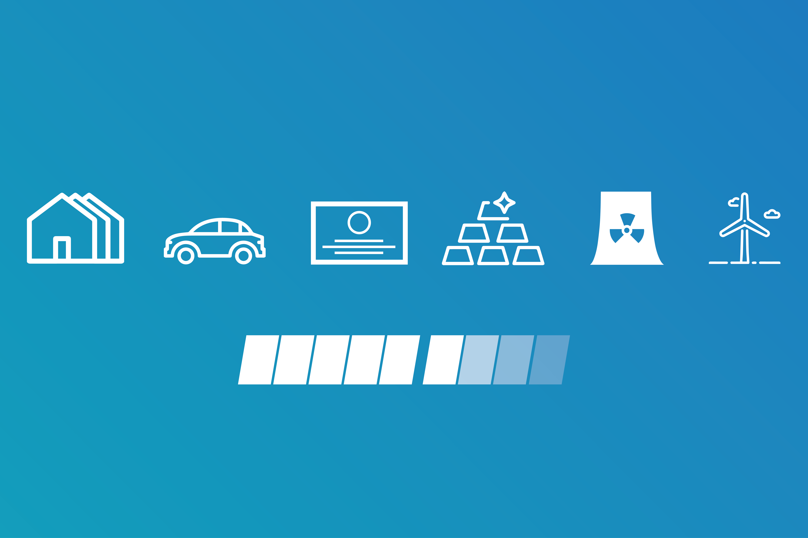

Tokenization provides more opportunities on lending. When property is tokenized, the tokens could be traded or pledged against a loan. This means that there would be tokens at the loan market that have less volatility and are more suitable as a collateral.  In near future, we do not see any obstacles on having Apple or Facebook shares tokenized and pledged against a loan on ETHLend. Even further, one could tokenize his house that is under construction and pledge it to receive a loan from lenders all parts of the world. The global competition on lending market would provide the most competitive interest rate for the borrower.

## <h3>Current and Future Use-Cases for Decentralized Lending</h3>

Decentralized crypto-currency lending is the new kid on the block. Lending address-to-address does have demand in today’s blockchain world. Theoretically, crypto-currency lending could be used for similar purposes as lending in the centralized economy. However, since address-to-address lending requires the need to secure the repayment of the loan, decentralised lending is in the stage of development.

First, there is no need for decentralization for lending ETH. Decentralization is needed when the parties do not know or trust each other for the repayment of the loan. In these situations, ETHLend provides a solution for securing loans by providing a Smart Contract which requires a collateral from the borrower. There are other means to provide trust between the parties such as reputation. However, requiring a collateral is sufficient here to establish neutral and equal lending market that is available globally for all.

Lending crypto-currencies is developing rapidly on the blockchain environment. However, the rapid development is ongoing because the field is relatively new. Moreover, decentralized lending is completely fresh area since the technology, innovation and the market have not reached beyond the level that decentralized lending would have valid solution to provide decentralized lending without the risk of loss of capital. However, now we propose a solution that makes address-to-address lending possible without the fear of default.

Curiosity and trading crypto-currencies. Until this day, most of the borrowers do borrow for the sake of curiosity on decentralized lending market. The users want to know how the decentralized lending functions. Another current use-case is crypto-trading. Particular borrowers use decentralized lending to get hold on ETH. Once ETH is received, they trade the ETH for other crypto-currencies or ERC-20 tokens, which are increasing in value faster than ETH. When the increase bypasses the ETH value on borrow including the premium added with profit, the borrower exchanges the bought crypto-currency or ERC-20 token back to ETH and pays the loan back. In this scenario, the borrower used his rare token that he did not want to sell and gained more ETH by using his scarce ERC-20 token to get access to leveraged trading (loan based trading).

Current finance market consist of barriers. In FIAT environment, there might not be a lender that would accept ERC-20 tokens or ENS domains as a collateral for the loan. Secondly, even if the crypto-trader would obtain FIAT-based loan, he would need to wait to get the loan into his bank account and after receiving it, exchange it to ETH and reverse the action when repaying the loan back. Therefore, the borrower would pay interest on days that the borrower factually is not using the loan capital for the borrower’s needs. Moreover, the circumstances might occur today that if the bank is not welcoming crypto-traders, the traders might not factually have even access to finance for his crypto-lending ventures.

## <h1>Why Ethereum Network?</h1>

Ethereum Network provides decentralized ecosystem. Decentralized lending requires value that could be send and received, Smart Contracts to perform more complex transactions and additionally Ethereum is well known. Ethereum is the first widely known blockchain network that allows Smart Contracts. Ether (ETH), the native token of Ethereum has gained much popularity in the last couple of years. For users to adopt decentralized crypto-currency lending there should be a crypto-currency that is widely used. Secondly, the blockchain ledger should deal with more complex transactions than merely sending and receiving value. There should be the possibility to add, store data and perform complex requests and calls.

Moreover, the possibility to use and create digital tokens ensures that Ethereum network is the right landscape for ETHLend. However, Ethereum is not perfect. We will cover the issues ETHLend might occur on Ethereum network, yet it does have the fullest potential where ETHLend might grow for wider use.

## <h2>Smart Contracts</h2>

Lending requires more than sending Ether. Decentralized lending requires a blockchain ledger that is able to run more complex transactions than the fundamental sending and receiving value. The core power of Ethereum is the adoption of Smart Contracts. This function provides the ability to use blockchain ledger extensively. Smart Contracts in general definition provides a solution to deploy commands on the blockchain network, which affect the way on how data is stored, represented or handled in the Ethereum blockchain network. This means that we can deploy code that executes but cannot be modified once deployed.

Loan agreement as a Smart Contract. The basic function of a loan agreement is the storage of data. This data includes the information on the loan capital, premium (interest charged), days to loan and the parties of the loan agreement. By using the aforementioned information, we can perform a loan transaction between trusted persons. However, when we want to enable workable solution for lending between borrowers and lenders that do not know each other, we need more than the data above.

Collateral enables secured lending. Lending to a person that we do not trust or know beforehand, we would require something that would either: (i) indicate from the past record or the present reputation that the borrower shall repay the loan or (ii) we secure the loan with a pledged collateral. To secure a loan with a collateral, our Smart Contract should store the collateral until the borrower has repaid the loan and the premium. The solution represents the basic pawnshop functionality. Ethereum Smart Contracts are flexible enough to handle storing collaterals such as ERC-20 compatible tokens or ENS domains.

Since the collaterals and the crypto-currency used for lending is within the ecosystem of Ethereum, it was convenient for us to choose Ethereum for the ledger. Alternative ledger would have to communicate with Ethereum network, which would create more complex engineering, which would not benefit the users.

Track record for lending. Another important function that ETHLend needed was a way to handle reputation-based lending. If the borrower would need always ERC-20 tokens to place a loan request, lending would be limited to users that have “token wealth”. Therefore, we introduce that on each repaid loan, the borrower is rewarded by our native ERC-20 Token called, Credit Token or CRE. By creating a Smart Contract for Credit Token, the reputation system is painless. Moreover, by using the Ethereum-based ERC-20 compatible token we are still working within the decentralized ecosystem, instead of resorting to off-chain credit ratings and the old tarnished banking and credit system. Therefore, by using ERC-20 token we factually create a decentralized credit rating system.

## <h2>Ether</h2>

Popular crypto-currency. Ether (ETH), the Ethereum native token (consider also as crypto-currency), was another decisive factor when choosing the ledger. Ether is widely used for dapps, trading and is growing for merchant payments. We believe that Ethereum with the use of Smart Contract is growing popularity not just developers but amongst users of Bitcoin and other Altcoins.

To establish a decentralised lending application we needed a popular crypto-currency. Of course, Bitcoin was the one with largest market capitalization. Ether comes second. Since Ethereum has the power of Smart Contracts and we were working within the Ethereum ecosystem, it became clear that Ether would be our choice for the lending currency. Moreover, Ether is faster in transactions than Bitcoin. Using any other altcoin would have created the need for the discussion between blockchains, which might not be an ideal at the moment.

## <h2>Tokenization</h2>

Tokenization of value is what fuels ETHLend. ERC-20 compatible tokens are used as a collateral to secure loans on ETHLend. When a token has value, the token can be pledged to secure the repayment of the loan. This practically means that the borrower promises to give up of the pledged token for the lender if the borrower does not pay the loan back. Pledging is quite common in the finance industry. Most commonly used collaterals are real property for mortgage or pledging shares of a listed stock company.

Tokenization is growing. Today there are few dozens of ERC20 tokens that have significant value and are traded in crypto-currency exchanges. Each week new token crowdsales are launched and there will be even more tokens that are open for trade. This effects that there would be more tokens that one could pledge for a loan at ETHLend.

Future of tokenization and lending. Today the tokens have many different representations. One of the interesting one is tokenization of commodities such as gold. At some point, it can be convenient to place a house or a new solar power plant as a token and trade the token or pledge the token to receive finance. Actually, tokenization is quite reachable today and the barriers lies within the formal requirements such as real property deed registrations and such. Therefore, even now one could issue ERC-20 compatible tokens that represents the shares of a company and agree on the shareholders agreement that the shares are represented on Ethereum-based ERC-20 compatible digital tokens. From that point, the share could be used as collateral for Ether loan for funding the company’s ventures or the shareholders’ needs.

Once the tokenization is widely adopted, the uses cases are beyond imagination. Borrower from Brazil could agree with the home seller that the borrower can place the house on ERC-20 token and pledge the house to obtain a loan to finance the purchase. Instead of resorting to Brazilian banks for mortgage, the borrower has full access to the global lending market.

Moreover, infrastructure projects are another example. Contractors could first issue a crowdsale of ERC-20 compatible tokens and after the crowdsale, the contractors could have even more access to liquidity by pledging the tokens that are left from the crowdsale and get more funding for the project. The opportunities and the use-cases are only limited by imagination.

## <h2>Paradox of Value: Smart Contract Deployment</h2>

Ethereum is not seamless. Ethereum has all the ingredients for developing decentralized Smart Contracts on-chain. However, deploying Smart Contract on Ethereum blockchain does not come without costs. Each time the borrower creates a loan agreement there will be exhaustion of small amount of gas. Besides the gas consumption, the deployment of the loan agreement would costs some small amount of ETH. Even though the consumed amount of ETH is currently small, the situation might change. When ETH price continues to surge, it will be more expensive to deploy the contract if the borrower is using funds that were shortly before the deployment converted from FIAT into ETH.

On the other hand, this is not a problem if the borrower lives in the crypto-currency economy. This might be the case for many within the next five years. It would mean that the user would get his income in ETH (or any other crypto-currency). In this case, the borrower do not need to bear the cost of rising ETH price. However, if there would be high amount of users from the FIAT economy, this would eventually mean that it would make more sense to borrow bigger amounts that resorting to microlending. This could raise the bar for access to finance, which worries us the most.

## <h1>Expanding Decentralized Lending and Decentralized Credit Rating beyond Ethereum network</h1>

Extensive project is nothing without an extensive plan. ETHLend will plan to expand the decentralized lending application to other blockchain networks. We have noticed that different blockchain networks have their own edges and the users are dividing between these blockchain networks. ETHLend wants to be accessible beyond Ethereum by providing similar lending functions on other blockchain networks as well.

Additionally, we are going to create a function to broadcast the data from our decentralized credit rating to other blockchain. By providing such data, the borrower can use his well earned credit score on other applications in other blockchains.

The function is so extensive that it is developed upon if we raise the whole token sale cap. Expanding to other blockchain networks is developed as the last milestone on our roadmap since ETHLend first needs a fully functional application on Ethereum network itself and we need to wait for other blockchain networks to ripe and the decentralized lending market to grow before we can expand our development to these new networks.

## <h1>The Decentralized Application (DAPP)</h1>

Decentralized lending. Ethereum provides the ecosystem for lending that is conducted on-chain. By decentralized lending we refer that all transactions are made on blockchain and all data that is associated with the loans are stored and running on the blockchain network. The solution provides safety, trust and transparency between the borrowers and the lenders.

Smart Contracts. Ethereum-based Smart Contracts provide the ecosystem for creating trustless functions between parties. By trustless we refer that we can eliminate the need to rely on third party services. All transactions are performed with the use of Smart Contracts. This means that when deployed, the loan agreement (the code) cannot be manipulated or compromised, even by ETHLend since the code is running on the blockchain, copying itself from hard-drive to hard-drive.

Smart Contracts for decentralized lending. Smart Contract are suitable for lending that does not happen on local or centralized services. In decentralized environment, there is need to secure or provide reputation based trust between the borrower and lender since we must trust that the loan is repaid back. Smart Contracts can handle complex transactions such as future payments, sending tokens, sending ENS domains and conducting all sorts of calculations. Moreover, Smart Contracts are capable to store and group data on blockchain which is important for the loan agreements since we need to store information on-chain regarding to the loan amount, premium, days to loan, collateral, the parties of the loan agreement.

## <h2>Technology Architechture</h2>

*	Meteor
*	NodeJS
*	Solidity
*	Web3.js
*   React
*   LiveScript
*   JavaScript
*   Java

## <h2>Secured Lending by Pledging Ethereum-Based Digital Tokens</h2>

Smart contracts are perfect for secured lending. In secured lending, we use a collateral such as an Ethereum-based ERC20 Token or ENS domain. Basic secured lending Smart Contract works in the following way:

Borrower creates a Smart Contract by creating a New Loan Request. 

     function createNewLendingRequest()payable byAnyone returns(address out){

          // 2 - create new LR
          // will be in state 'WaitingForData'
          out = new LendingRequest(mainAddress,msg.sender,whereToSendFee);

          // 3 - add to list
          uint currentCount = lrsCountPerUser[msg.sender];
          lrsPerUser[msg.sender][currentCount] = out;
          lrsCountPerUser[msg.sender]++;

          lrs[totalLrCount] = out;
          totalLrCount++;
     }

Borrower places data on the Smart Contract, such as the loan amount, premium, which token is used for collateral, amount of tokens and the collateral token address

     State public currentState = State.WaitingForData;

     // This must be set by borrower:
     address public borrower = 0x0;
     uint public wanted_wei = 0;
     uint public token_amount = 0;
     uint public premium_wei = 0;
     string public token_name = "";
     string public token_infolink = "";
     address public token_smartcontract_address = 0x0;
     uint public days_to_lend = 0;

Borrower sends the tokens to the Smart Contract

     function checkTokens()byLedgerMainOrBorrower onlyInState(State.WaitingForTokens){
          ERC20Token token = ERC20Token(token_smartcontract_address);

          uint tokenBalance = token.balanceOf(this);
          if(tokenBalance >= token_amount){
               // we are ready to search someone 
               // to fund the loan
               currentState = State.WaitingForLender;
          }
     }

Lender funds the loan by sending loan amount to the Smart Contract

     function waitingForLender()payable onlyInState(State.WaitingForLender){
          if(msg.value<safeAdd(wanted_wei,lenderFeeAmount)){
               throw;
          }

          // send platform fee first
          if(!whereToSendFee.call.gas(200000).value(lenderFeeAmount)()){
               throw;
          }

          // if you sent this -> you are the lender
          lender = msg.sender;     

          // ETH is sent to borrower in full
          // Tokens are kept inside of this contract
          if(!borrower.call.gas(200000).value(wanted_wei)()){
               throw;
          }
          currentState = State.WaitingForPayback;

          start = now;
     }

a) Borrower repays the loan by sending loan amount back and the premium to the Smart Contract. Lender receives the loan amount and premium and borrower receives the tokens back from pledge; or

     // if time hasn't passed yet - Borrower can return loan back
     // and get his tokens back
     // 
     // anyone can call this (not only the borrower)
     function waitingForPayback()payable onlyInState(State.WaitingForPayback){
          if(msg.value<safeAdd(wanted_wei,premium_wei)){
               throw;
          }

          // ETH is sent back to lender in full
          // with premium
          if(!lender.call.gas(200000).value(msg.value)()){
               throw;
          }

          // tokens are released back to borrower
          ERC20Token token = ERC20Token(token_smartcontract_address);
          uint tokenBalance = token.balanceOf(this);
          token.transfer(borrower,tokenBalance);

          // finished
          currentState = State.Finished;
     }

     // How much should lender send
     function getNeededSumByLender()constant returns(uint out){
          uint total = safeAdd(wanted_wei,lenderFeeAmount);
          out = total;
          return;
     }

b) Borrower does not repay the loan on time, the tokens are transferred to the lender (who can sell the tokens on exchange)

     // After time has passed but lender hasn't returned the loan ->
     // move tokens to lender
     // 
     // anyone can call this (not only the lender)
     function requestDefault()onlyInState(State.WaitingForPayback){
          if(now < (start + days_to_lend * 1 days)){
               throw;
          }

          // tokens are released to the lender 
          ERC20Token token = ERC20Token(token_smartcontract_address);
          uint tokenBalance = token.balanceOf(this);
          token.transfer(lender,tokenBalance);

          currentState = State.Default; 
     }
	 

Above was excerpts of the solidity-based Smart Contract on secured lending. The above demonstrates how a simple loan transaction where the collateral is stored on the contract and all transactions are handled within the Smart Contract that the borrower creates.

Smart Contracts provide the solution for the borrower and the lender to perform a secured loan without relying on third parties. Since Smart Contracts can store ERC-20 compatible tokens and ENS domains, the collateral is easily moved to in any direction. This might not be the case in real life. Moreover, since ERC-20 tokens can represent any value from centralized world, Smart Contracts would provide the possibility to control this value on blockchain. Theoretically, anything can be used as a collateral once tokenized, even a dog.

## <h2>Demonstration of the DAPP</h2>

In this section, we will demonstrate how ETHLend DAPP works from the user experience perspective. We will go step-by-step walk-through on how to request a loan and to fund a loan. You will need to have Google Chrome and the MetaMask plugin installed. MetaMask is Google Chrome plugin to allow decentralized application, such as, ETHLend, to be run in the browser without downloading the full Ethereum node.

To download Google Chrome, please visit:

https://www.google.com/chrome

To download MetaMask, please visit:

https://metamask.io/

 

Click ‘GET CHROME PLUGIN’

 

Click Add to Chrome

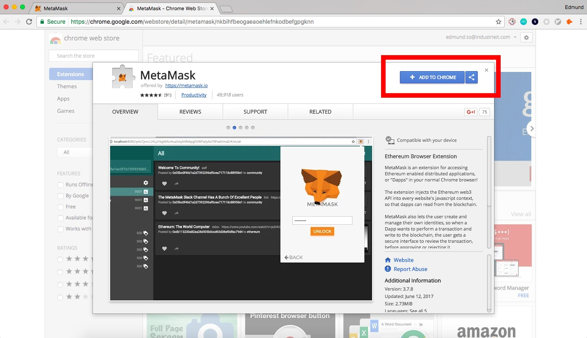
 

Click Add extension

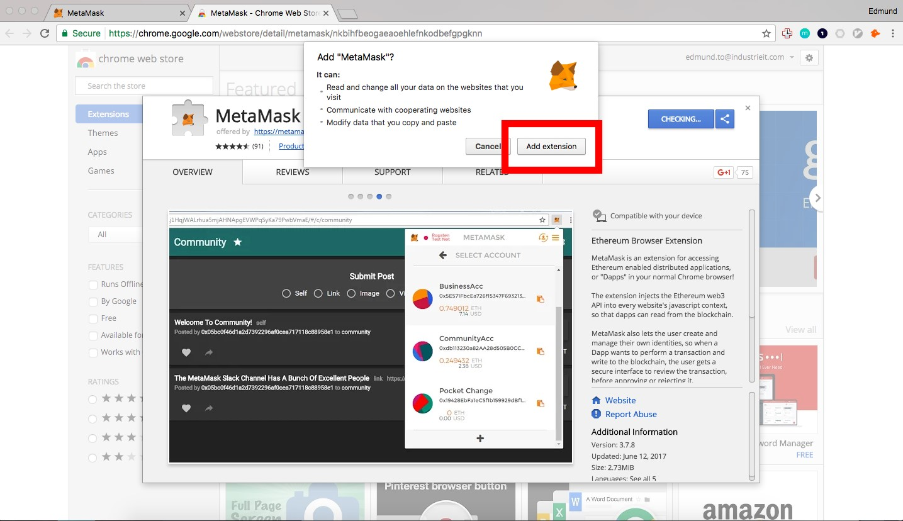
 

In the top right corner, you will see the icon of MetaMask

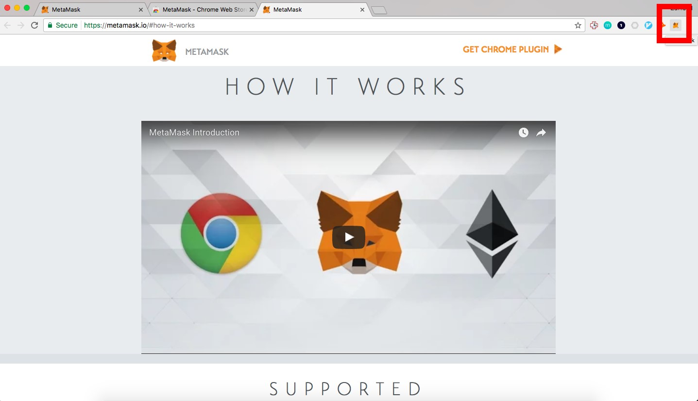
 

Click accept after reading and accepting the privacy policy

 

You will then create your MetaMask account here

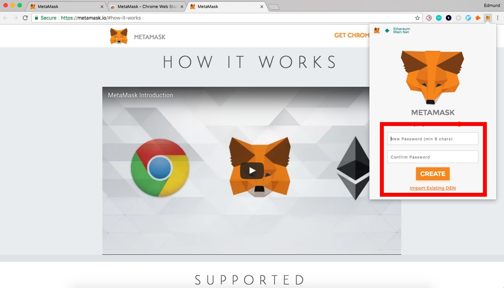
 

After creating the account, you will be provided 12 words, which will be used to recover your account

 

You can see the details of your account and you can request a loan or fund a loan of ETH using ETHLend now

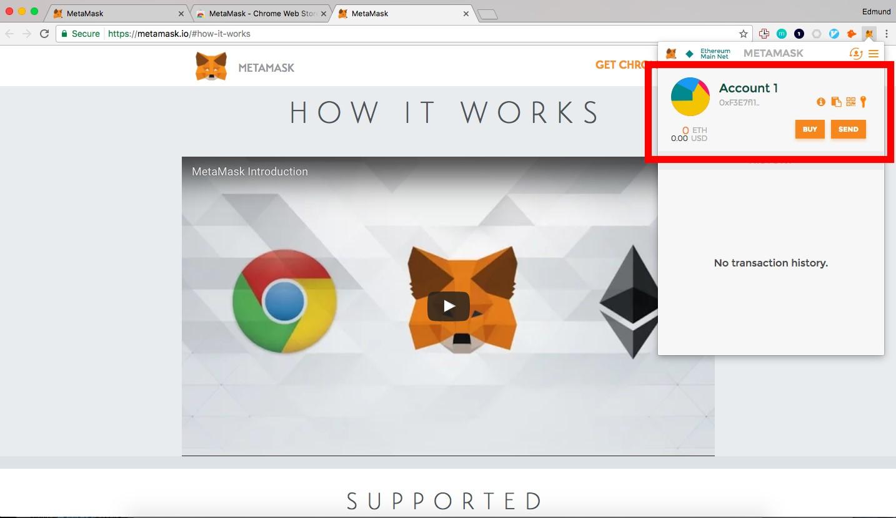

## <h3>New Loan Request</h3>

In the upcoming sections, we are going to demonstrate two scenarios:

1.	Borrower repaying the loan and lender receiving his original principal plus interest

2.	Borrower not repaying the loan and lender receiving the tokens which borrower pledged as collateral

Before dive into that, we will introduce a few useful resources here:

Ether Scan: https://etherscan.io/ - You can check the details of your Ethereum account, such as balance of ETH and ERC-20 tokens

Token Factory: https://tokenfactory.surge.sh/ - Transfer token to another Ethereum account

Coin Market Cap: https://coinmarketcap.com/ - Live prices of ETH and ERC-20 tokens. Useful for calculating the amount of collateral, tokens, needed to make an attractive borrowing request

Ether Delta: https://etherdelta.github.io/ - Exchange for trading tokens. For lenders to sell ERC-20 tokens and purchase ETH if they wish when the loan is defaulted

We will have three accounts - lender, borrower1 and borrower2.

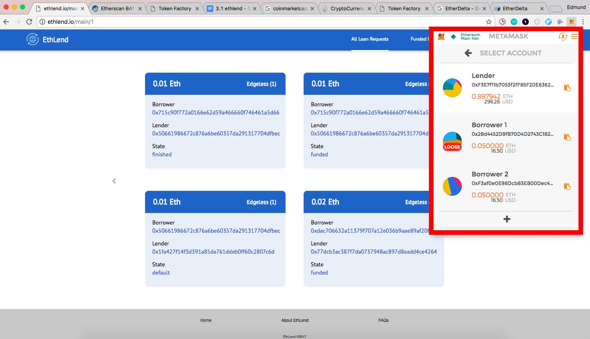
 

We are going to use Basic Attention Token (BAT) as collateral. For more information about BAT, please visit https://basicattentiontoken.org/

 

To create a loan, first click New Loan Request

 

MetaMask should pop up, and after reviewing you would need to click accept to continue

 

The message ‘Done!’ will be displayed after the transaction goes through

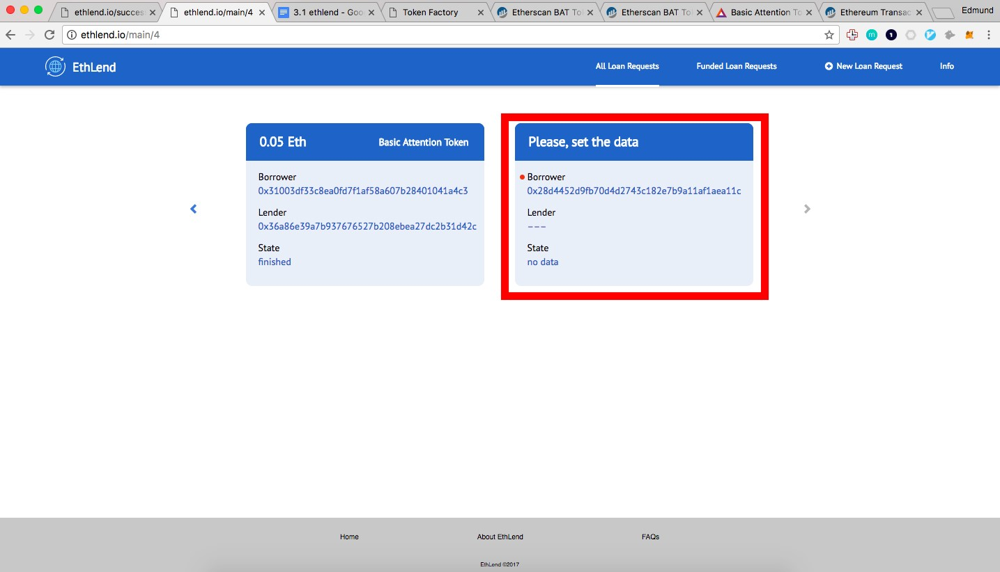
 

If you go back to All Loan Requests and shuffle the loans, you will see that a new loan is created. The red dot indicates that it is your address.

## <h3>The Loan Contract</h3>
 

After that you clicked into the contract you just created, enter the details of the contract

 

Then click Set Data and MetaMask will pop up again for you to confirm

 

The message ‘Done!’ will be displayed when the transaction is completed.

## <h3>Sending Digital Tokens to the Smart Contract</h3>
 

We will see the status of the contract is changed to ‘waiting for tokens’

 

You will need to transfer the amount token set in the contract to the address given

 

You can visit Token Factory to transfer tokens to the address, first click ‘interact with token contract’ (Alternatively, you can go to your Ethereum wallet and sent the tokens to the loan Smart Contract).

 
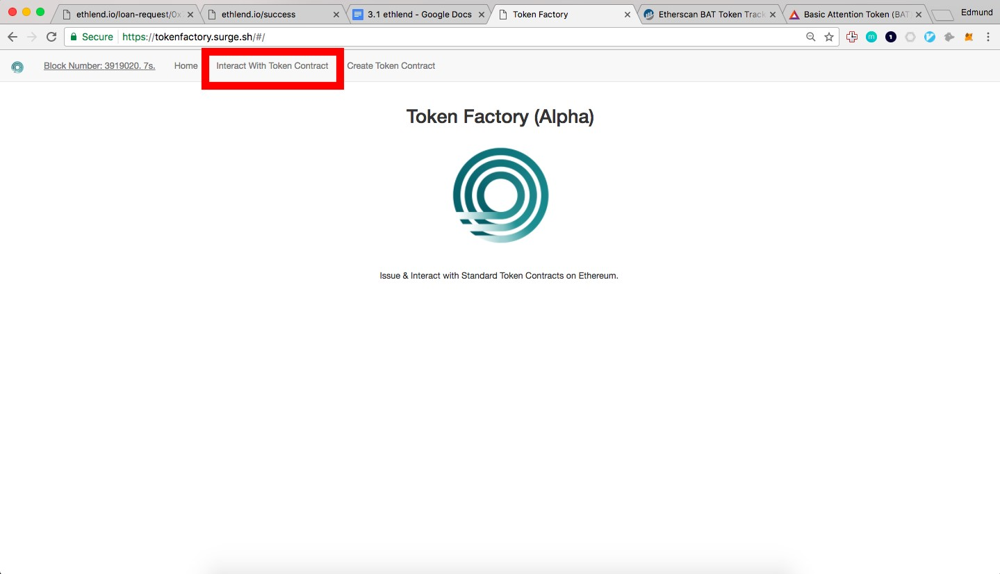
 

You will be asked for the token address

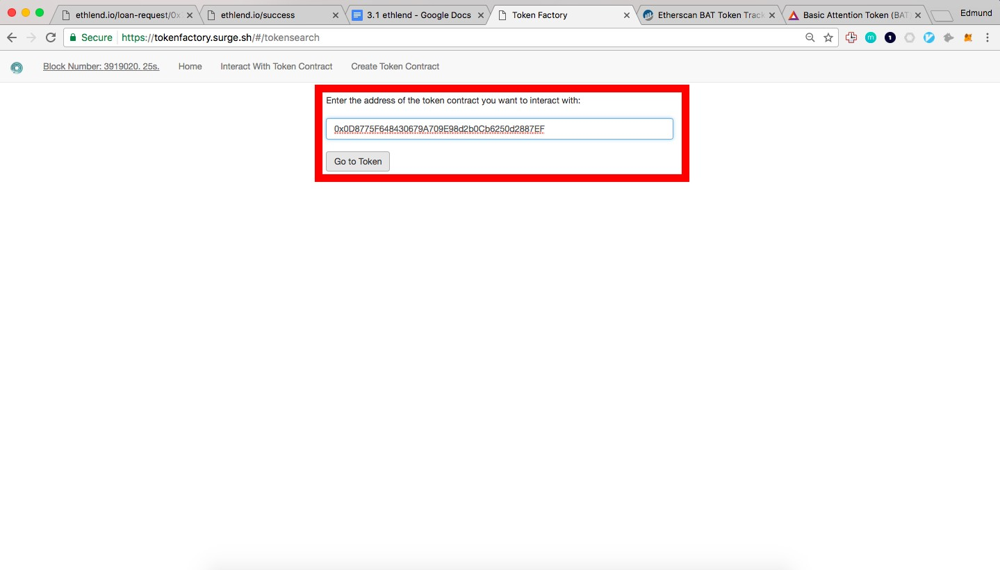
 

You can find out the contract address information on Etherscan

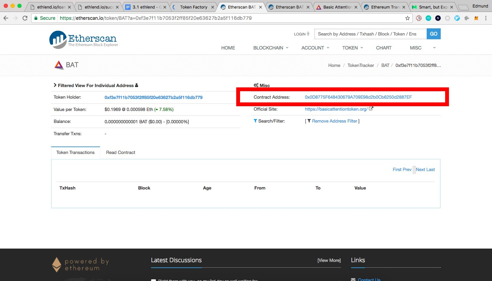
 

You can also check your balance here to ensure you have sufficient amount of tokens

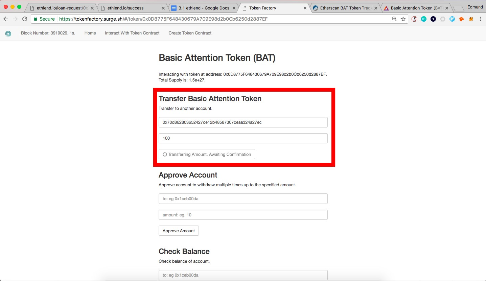
 

You can transfer the token to the address given in ETHLend here

 

Once transfer is completed, you can go to ETHLend to check on the status and you will be asked to confirm on MetaMask

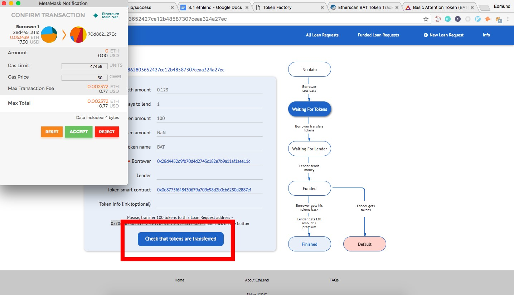
 

After that is competed, you will see the status of your loan has changed to waiting for lender

## <h3>Funding the Loan</h3>
 

This is an example we are going to switch to a lender account. In practice, the following steps will be conducted by a lender

 

After selecting the loan, lender can click fund this loan request

 

Confirm via MetaMask

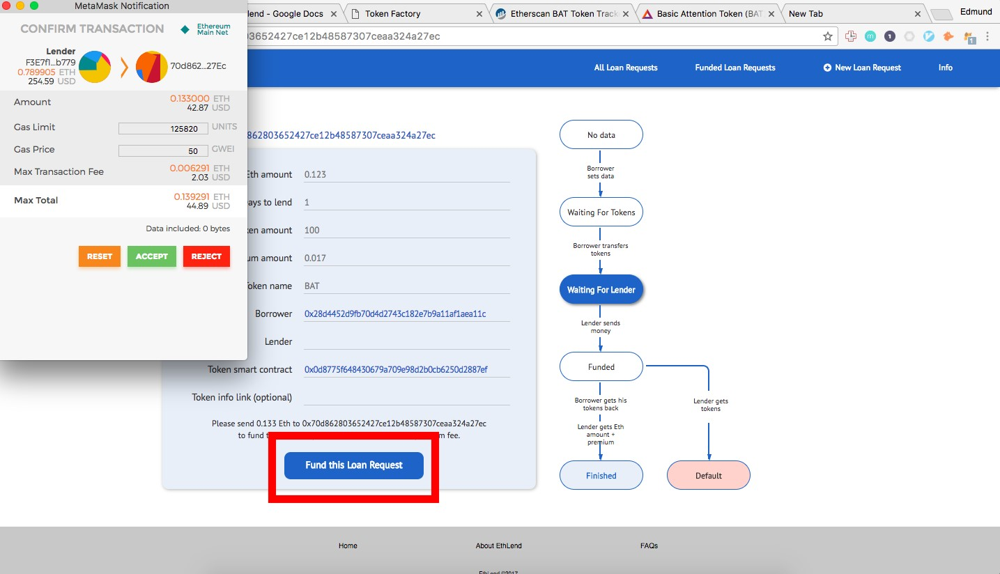
 

Borrower has successfully received his loan

## <h3>Paying the Loan Back</h3>
 

As the borrower, you can choose the loan you would like to repay

 

Click return token and confirm via MetaMask

 

You can see in the balance borrower has returned to lender the loan amount plus interest

 

Borrower has received back his token pledged earlier for collateral

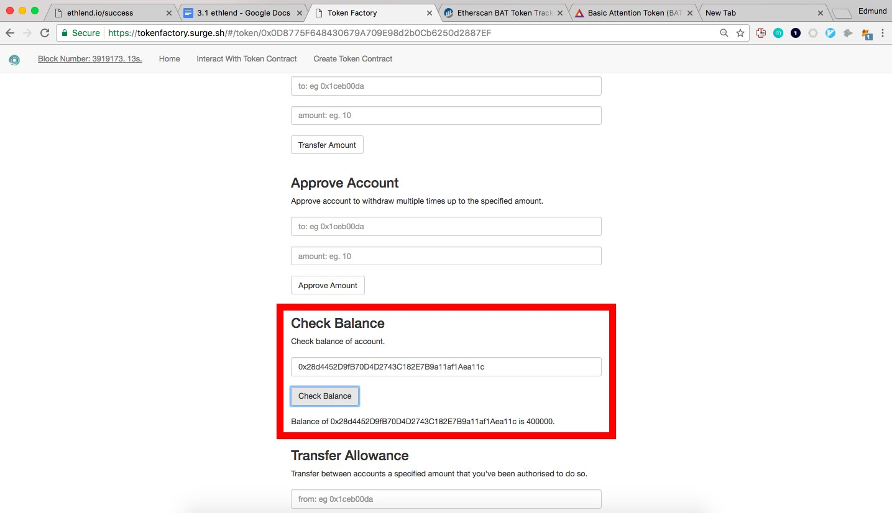

## <h3>Default Scenario</h3>
 

We are going to demonstrate a default scenario next

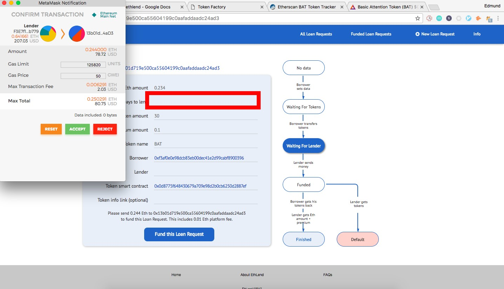
 

We follow identical steps except for the number of days we are putting 0 day to simulate the loan defaulting

 

After the loan is defaulted, lender can see the message has changed to get token

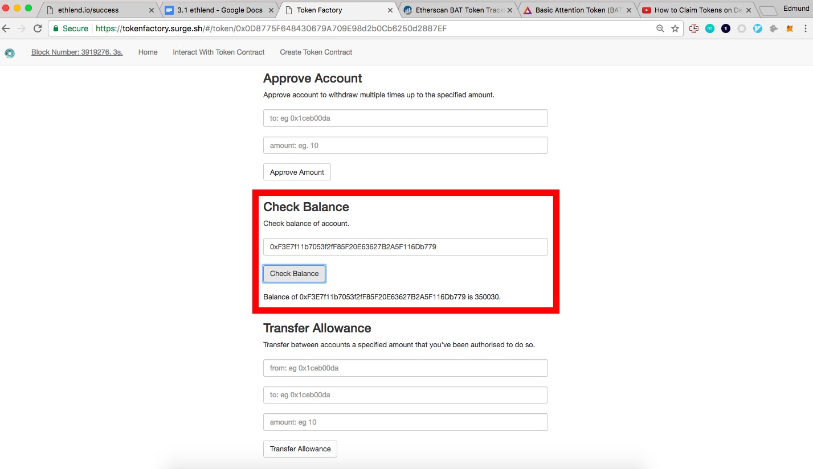
 

Lender can claim the token and we can confirm on token factory

## <h2>On-Demand Lending</h2>

Learning curve for the borrower. Currently the ETHLend’s decentralized application provides solely that the borrower can create the loan request. This means that the borrower must have a basic understanding on lending. The borrower must place such data as the premium, amount of tokens for pledge and the token Smart Contract address. It might be difficult for a first time borrower to evaluate the value of the ERC-20 token (even if the token is traded on the exchange) and the amount of premium which borrower is willing to accept to pay. If the borrower sets too low premium or overvalues the collateral, the loan might not be attractive for the lenders. This would mean that the loan would not be funded.

Liquidity provided by the lender. Alternative for the borrower’s loan request, ETHLend shall adopt a Smart Contract where the lender may place the loan offer for the borrowers. The lender creates a Loan Smart Contract. The lender inserts data on how much liquidity the lender in total is willing to lend, on what premium, and which tokens the lender is willing to accept for collateral. After the lenders Loan Smart Contract is deployed, anyone may lend from lender simply by sending ERC-20 tokens to the Smart Contract.

On-demand lending. The lender provides as above state liquidity for any borrower with the pre-set conditions. This means that instead of participating in multiple loan requests, the lender can handle all loans form one Smart Contract. When a borrower returns the loan the, the token is released and sent back to the borrower and the lender Loan Smart Contract has more liquidity for lending. Factually, we have here an on-going lending institution that the lender has created. The lender may at any point close his loan offer. This would mean that no new loans are granted and the borrowed capital will close on due.

Flexibility and shorter learning curve for the borrower. On-demand lending provides flexibility for the lender. The lender does not need to fund single small loans, instead the lender can place the terms for the loan capital and anyone can borrow merely by sending the accepted ERC-20 token to the loan agreement. For the borrower, on-demand lending means less necessary knowledge on lending. The learning curve is transferred from borrower to the lender, which means that the borrower does not have to evaluate the value of the collateral or evaluate the attractiveness of the premium. Of course, if the borrower is not satisfied of the price of the liquidity that the lenders are providing, the borrower may always place a loan request with its own terms.

## <h2>Secured Lending by Pledging Ethereum Name Service Domains (ENS)</h2>

New name service created a gold rush. Ethereum Name Service Domains (ENS) are domains that are used in the Ethereum ecosystem. ENS domains provides a way to use a name for the long Ethereum address. For example if one would like to send ETH to Jim, the person would need to write long Ethereum address. By using ENS domain one could just sent the ETH to an ENS domain such as jim.eth (which is owned by Jim) and the ETH will be transferred to Jim’s Ethereum address.

ENS domains are auctioned against ETH. ENS domains are not actually bought but the ownerships is guaranteed by willingness to lock ETH for at least a year. When the auction is ended, the new owner of the domain is able to create subdomains, lease, loan or sell the domain. This means that the domain can be sold further to a third party or pledged for a loan. Today, as of 22 June 2017, there are over 75 000 registered domain names. If ENS domains would be ICANN gTLD domain, it would be the 48th largest between .solutions and .news.

ENS domains have significant value. ENS domains bear at least two forms of value. The first form of value is the ETH that is locked in the domain. For every single .eth domain there is an auction. Today there are 341 643 auctions started. The winning bid of the auction means that the second highest bid ETH amount is locked down on the ENS domain Smart Contract. There are currently 148 312 ETH locked down on ENS domains which results in 50 361 713 USD. Moreover, there are currently almost a billion dollars’ worth of ETH deposited in bids. This means that there are plenty of interest in ENS domains.

Unlocking the benefits of ENS domains. Since ENS domains hold ETH that cannot be used, pledging domains might be perfect option for those that would want to use some of the Locked ETH. The reason practically lies in the fact that unused funds could be placed for use to attract more funds or other use. The highest locked down amount on ENS domain is darkmarket.eth (20 103.10 ETH, equivalent to 6 826 329 USD) and followed by openmarket.eth (10 054.76 ETH, equivalent to 3 414 255 USD). Locking the funds means that these funds could not be used or moved. However, the locked down funds could be used for other purposes such as bidding on other ENS domains or using the funds on other investments instead of letting the funds lie in the ENS domain Smart Contract.

Even though it might not seem idealistic, when .eth domain that holds 0.01 Ether value would be up to pledge. However, ENS domains do have other value than the locked up Ether. Domain names are scarce. This means that even though an ENS Domain might hold as low as 0.01 Ether locked, it might have other value as well. For example, flourist.eth (which is not taken yet) might go for 0.01 Ether. However, the ENS domain might have future value or value for the industry or topic that the domain is related to.

For example, one might create a sophisticated Smart Contract on Ethereum that would track the source of flowers, thus giving an edge to florists’ who adopts the chain. In this sphere, flourist.eth might become quite popular even though the locked value is 0.01 ETH. This would mean that low bid domains is usable for pledge when valued carefully.

ENS domains as a collateral. Domains are great for collateral for two reasons. First, the amount of collateral is the same. When pledging ERC-20 tokens, on can pledge more than one token. When pledging ENS domains, you will have a single value because you cannot pledge more than one domain for the same loan (at this point). This makes things easier.

Secondly, ENS domains can be pledged against the lockdown value to cover the loan amount and the premium. This means that the amount of ETH does not change during the pledge. Therefore, unlike pledging Ethereum-based digital tokens, the borrower could create a loan request that is guaranteed 100% by the ENS domain lockdown without the risk of volatility that ERC-20 tokens might bear.

On the other hand, one must notion that the locked down ETH is released when the domain period ends, usually within a year. However, this does not stop the lender to sell the domain on an auction just as a digital token or hold the domain itself if it is scarce and wait the ecosystem to develop further.

ENS domain collateral Smart Contract. The ENS domain by design is transferrable. Transferability provides that the ENS domains are capable for collateral.  When a borrower on ETHLend pledges an ENS domain for a loan, the borrower needs to send the ENS domain to the Smart Contract. The Smart Contract will hold the ENS domain in case the borrower does not repay the loan back. In case of default, the lender is able to claim and transfer the ENS domain to his address for further realization.

Consequently, the ENS domain pledge follows the same roadmap as the tokens pledge. The main distinction is that on token pledge token smart contract address is used for interaction and data. On the other hand, in ENS domain pledge we are using the hash key provided by the ENS registry for transferring the ENS domain to the Smart Contract. The use of Smart Contract additionally guarantees that the address where the received funds are allocated does not change during the pledge, providing security and transparency for the borrower.

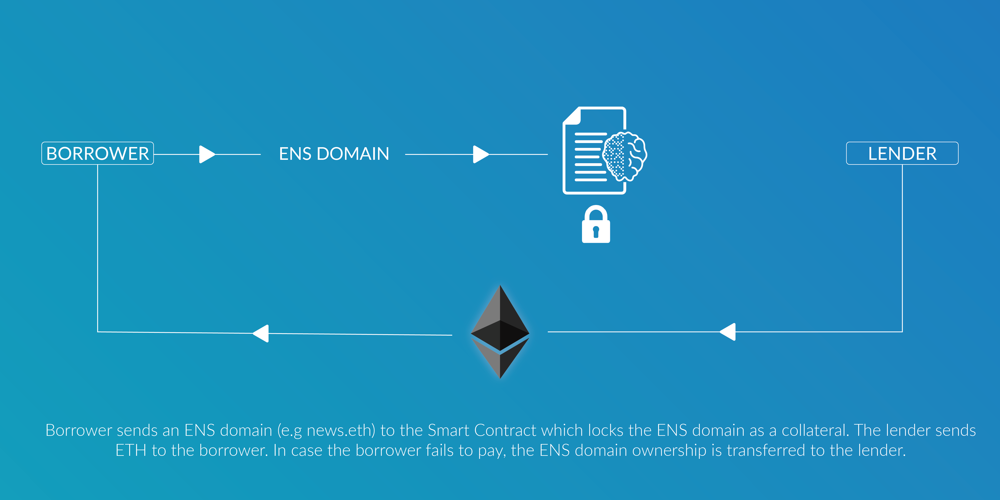

The rapid growth of ENS domains will lock down vast amount of ETH in to the ENS Smart Contracts. This means that at some point there shall be ETH locked that could be worth of billions of USD. Therefore, ENS domain pledge provides a convenient way to “unlock” these funds for use by obtaining funding and pledging the ENS domain. Eventually ENS domains could end up being even more suitable alternative for a collateral for a loan. ENS domains do not have the volatility that some of the ERC-20 tokens might have. Of course, the volatility with the tokens might disappear eventually and would follow such volatility that is seen on stock market or currency exchange. However, since tokens do differ this not the case for all tokens.

## <h2>Lending Based on Reputation and Credit Token (CRE)</h2>

Uncollateralized loans brings wider borrower audience. Secured loans which require a collateral such as ERC-20 tokens or ENS domains provides the starting point for decentralized lending. When there is a security that can be realized to regain loss, trust is not decisive since the collateral is held on the smart contract address. Without using collateral, it would be challenging for borrowers and lenders who do not know each other to trust.

However, the use of collaterals do raise the bar for access to finance (which we are aiming to lower on the long run). While collateralized loans are truly a trustless solution for decentralized lending, eventually to achieve a burst in crypto-lending, uncollateralized lending should be adopted. However, current crypto-lending solutions do not live in the decentralized environment yet. Moreover, an option that would implement real-wold credit scores would not be in our mind a sufficient solution, merely an escape route back to the centralized environment. Such solutions should be avoided, but not rejected fully since centralized environment is much needed to on-board users to the decentralized economy.

Reputation is accredited. Reputation system is a convenient way to establish trust between the borrowers and the lenders. Trust means that the lender is willing to provide a loan even if the loan is not secured by a collateral. Reputation-based decentralized lending is based on previous repayments of loans. This means that the borrower needs to present previous behaviour of repayments. Due to the pseudo-anonymous nature of cryptocurrencies and Ethereum addresses, willingness of future repayments is difficult to estimate without an indication of past compliance. By using reputation, we remove portion of this uncertainty on uncollateralized loans. By limiting borrowing to reputation, there is less risk on encountering an address that did not have any intention for repayments.

ETHLend manages reputation with Credit Token. Credit Token (CRE) is an ERC-20 compatible token that is used within the ETHLend. Credit Tokens cannot be traded or even transferred to another address. The sole function of CRE is to represent the borrower’s reputation on ETHLend. Each repayment of the loan mints CRE (1 ETH loan mints 0.1 CRE). This CRE can be used in two different ways. First, on collateralized lending, high amount of CRE indicates reputation and attracts the lenders even if the collateral is not sufficient or would require higher interest rate. Secondly, the important aspect of CRE is that it provides access to unsecure lending, which has been already adopted on ETHLend within the expectations set in the technical roadmap.

Access to uncollateralized lending. On each loan repayment, CRE is minted. This means that if the borrower repays 10 different loans, each loan amount of 1 ETH (10 ETH on total), 1 CRE is minted and transferred to the borrower. The borrower now can use the 1 CRE to access uncollateralized lending. This means that the borrower does not have to use a collateral for the maximum of 1 ETH. If the borrower does not repay collateralized or uncollateralized loan, all borrower’s CRE is burned. The idea here is to raise the threshold on defaults. The borrower might not be eager to default a loan for the sake of losing all his CRE balance.

Uncollateralized lending does not come without risks. Uncollateralized lending means that if the borrower does not repay the loan, there is no collateral, which would compensate the lender for even part of the losses. However, CRE provides a higher threshold for defaults since CRE represents the borrower’s past behaviour and sets a threshold for losing the accredited reputation, which accumulates on repayments. CRE can be compared to centralized credit score or rating systems. For example, if you default by not paying your electricity bill, you might not get a bank loan or even an insurance in most countries. The distinctive difference between centralized credit rating system and the decentralized is that in most countries centralized systems start with the default of person being creditworthy. On the other hand, in decentralized credit rating the creditworthiness must be accredited due to the pseudo-anonymous nature.

Even though, a reputation system is not a new invention, using an ERC-20 token for reputation management is a fascinating method to create the system in the decentralized environment. Other means would be merely by broadcasting centralized reputation value on the blockchain. However, digital tokens provide more transparency and trust, since the ERC-20 token is created with its own smart contract. Moreover, the data is easily removed from defaulted borrower since digital tokens can be burned on default.

## <h2>Credit Risk Assesment</h2>

Credit risk is the Achilles heel in decentralized lending. Much of the criticism on decentralized lending is focused on the risk. Indeed, the risk assessment criticism can be toned down with the use of sufficient collateral. However, collateralized lending itself would not be decentralized lending in its fullest potential. Therefore, solutions should be found that concentrate on how uncollateralized lending would be efficient in pseudo-anonymous environment.

Moreover, the most fundamental solutions should be decentralized in nature. This means that implementing gateways for centralized credit rating facilities should not be the first solution, and hopefully not even the last solution. There is an argument that decentralized solutions is impossible without integrating centralized credit rating systems. We bed to differ since if this would be the case, there would not be uncollateralized lending in societies before credit institutions were born. We believe that as credit scores have been built around humans, so could credit scores be formed around addresses. Despite of the decentralized focus we will demonstrate and implement to our roadmap solutions for centralized data feeds for the users to make lending even more efficient (to lower interest rates).

## <h3>Decentralized Credit Rating (DCR)</h3>

Assessing credit might seem difficult due to the use on pseudo-anonymous Ethereum addresses. However, this might be a common misconception. Couple of hundred years ago, it was quite common that a farmer had to borrow credit from a lender. The same farmer might have borrowed from the same lender time to time. Once there was a market for credit, the farmer might ask a loan from another lender. Here the new lender might wanted to know whether the farmer has previously paid the loans by asking information from the previous lender. This previous lender then would share the information and even monetize the data. Later a more modern credit rating developed where being creditworthy is default unless otherwise shown.

Decentralized credit rating might have massive impact on decentralized economy. By following the above example, we believe that credit rating can be established with a similar method. If a borrower wants to gain liquidity, the borrower would want to repay loans. Once there is a track-record of repayments the lenders are more confident to lend to the borrower who has previous history of repayment.

Unleashing decentralized credit rating. Credit rating is borne once there is data available on paid loans, the interest rates, possible collateral, and details of the lenders (and their transactional data) and the transactional data of the address. From this data a credit profile can be built by assessing the data. Such information as the monthly balance of the address, when the first transaction was committed are important amongst other decisive information. Such data can be manually analysed by the lender (or lenders), using peers (prediction market) or using artificial intelligence to predict the credit risk.

Decentralized credit rating as a by-product. The decentralized credit rating is born first and foremost of the lending history. Factually, this information is precious since the data could be exported and shared with other decentralized (or centralized) lenders or for transactions that require trust. By sharing this information, we would have a similar credit rating in the decentralized environment as there was in place couple of hundred years ago. It has its drawbacks that the borrower could forfeit the address. However, the same situation is in centralized environment today. One can lose good credit reputation.

The most plausible counterargument that is left is that Ethereum address can be abandoned with lower threshold than in the centralized environment where debt enforcement is efficient. Even that such argument is plausible, the situation changes mostly when decentralized economy is evolved to the point where such decentralized credit rating could be used and shared with other decentralized service providers and even reward based enforcement could be attached. Of course, an easier way so solve this issue would be to connect a gateway to on-board centralized credit rating systems. However, such solution would not be decentralized, but might provide quicker on-boarding for the decentralized lending environment.

Credit Token as the root for decentralized credit rating. Since the borrower receives Credit Tokens for loan repayments, this is ideal to use for scoring. Currently, Credit Token has its drawbacks since Credit Token could be created by using multiple addresses. The solution here is currently to review the borrower’s address, previous loans and the lenders associated with the borrower.

However, Credit Token can be developed in many ways. The amount of Credit Token received on repayments could be associated with the lenders’ reputation, the interest rate, loan period, account age, lenders’ account age and the IP addresses used. There is plenty to research for on the topic and we believe that Credit Token could be the future way to represent the address reputation not solely on ETHLend, but for the use of other service providers. Next we will demonstrate other tools to handle the risk assessment and which could be added to the decentralized credit rating system.

## <h3>Prediction Market to Predict Credit Risk</h3>

Prediction Market is one of the use-cases presented on Ethereum network. Augur and Gnosis are one of the projects that are focusing on the prediction markets. Prediction market could be an interesting way to assess whether the borrower will repay. In prediction market, the users are predicting by placing a bet on behalf or against the occurrence. Such prediction market could be established in ETHLend by creating a decentralized prediction market or using decentralized prediction market such as Augur or Gnosis.

Prediction market could be accurate if there is enough participants and good data available to assess the credit risk. First, the prediction market is plausible tool since the betters are using they liquidity. However, there are drawbacks such as the borrower trolling a prediction. Therefore for a prediction market to work, there should be sufficient amount of participants and stakes to overcome the bad data.

Predicting the credit risk. Using prediction market would mean that third parties would assess the transactional data on the ledger, previous loans and the previous lenders and the current lender. The aim is to review and find such information that would either indicate stable use and repayment or whether there is indication of dumping the address. ETHLend wants to develop a market where such data is available and to make it available to predict on these loan transactions. Such a prediction market would (i) help lenders to assess credit risk, (ii) create an additional revenue stream for predictors and the smart contract and (iii) provide more data for the decentralized credit rating system. According to our roadmap such prediction market will be developed by the end of October 2018 if the funding amount is reached.

## <h3>Artificial Intelligence and Ledger Big Data to Predict Credit Risk</h3>

Distributed blockchain ledger include massive amounts of data. Ethereum ledger includes transactional data of every transaction broadcasted to the network. This data can accessed free. Such data could be used in financial decentralized application. Today, not much of the data is used in decentralized application. Since the data is free to read, we believe that eventually many big data and artificial intelligence professionals will be interested in using the data. Using the ledger data might not necessary require to in-depth understand solidity skills on which smart contracts are created on Ethereum blockchain. Such data can be processed and interpreted with the use of blockexplorers (such as Etherscan) APIs.

Using artificial intelligence to assess credit risk. Artificial intelligence (AI) is growing in the use of financial industry. There are projects where AI is used to assess credit risks. Such analysis can be performed on the ledger data and the past loan history of the lenders and borrowers. AI would work in the similar way ask real human on the prediction market. ETHLend will provide a protocol to enable to use past loan transaction data and the ledger data easily available for AI and Big Data developers.

These developers can launch AI bots that assess credit risk. A developer can decide what data the AI bot uses and how the data is assessed. The performance of the AI bot can be simulated and once the performance reached a threshold for live use, lenders can choose an AI bot to assess the credit risk of future loan transactions. Once the lender starts funding and the loan is repaid, the lender can share part of the profit with the AI bot. Such autonomous bots generate revenue for the developers and provides an inventive to create more efficient bots. Moreover, a threshold can be set, that once the bot assessment rate is lowering, the bot can be killed (access to the environment is restricted).

The use of AI and Ethereum ledger data would be one interesting way to provide more tools for the lenders and an incentive to the AI and Big Data professional to get introduced to Ethereum and the distributed ledger technology. For decentralized lending, such protocol would eventually mean that there would be autonomous credit rating institutions running on the blockchain network. At some point such a bot could even punish itself for bad assessment and repair the way it analyses. We believe that AI could provide much help for establishing and being as an additive to the decentralized credit rating.

## <h3>Gateway for Decentralized Identities to DCR</h3>

Self-sovereignty as reputation. uPort provides a self-sovereign identity system. uPort identity system provides the possibility to claim a decentralized identity. User could register credentials through uPort. Self-sovereign identity could be as an additive to the decentralized credit rating. Such identity could establish that an address belongs to someone, or that the person who is controlling the address has history. Such information could be used as an additive to the decentralized credit rating system. Moreover, if such self-sovereign identity systems would be in popular use, such systems could be used to access reputation-based lending if there is gained reputation in other decentralized service providers than ETHLend.

Such self-sovereignty would be efficient if the data is proven and the defaults and other malicious behaviour could be attached to the identity. The loan default would eventually mean that the sovereignty of the uPort user would be affected in other Ethereum-based applications as well. This would be a risk and loss for the user that has built his reputation on uPort.

Gateway for first time borrowers. uPort could be a solution for borrowers that do not own ERC-20 tokens or ENS domains to use as a collateral for the loan or do not have reputation to access reputation based lending. Since the borrower needs to repay secured loans to receive Credit Tokens to access unsecured lending, uPort would be a solution to access unsecured lending without the need to participate to secured loans in the first place.

The high risk of defaults (when using uPort) can be limited by the amount of ETH that the borrower can loan. For example, uPort loans can be limited to 0.1 ETH and only to a one loan per sovereign user. Therefore, by active lending the borrower can gain Credit Token, which eventually replaces the need for uPort on unsecured loans and provides access to higher and less restricted loan amounts.

uPort would not eliminate the risk of default completely. It reduces the risk in similar manner as the ETHLend’s native Credit Token is reducing. The distinctive here is that uPort would provide reputation from outside ETHLend, from other applications.

## <h3>Oracles: Feeds from Centralized Providers to DCR</h3>

Feeds from centralized credit institutions. Oracles are an interesting way to submit data from centralized environment to decentralized environment. There has been suggestion by the community that ETHLend could establish a gateway for performing credit scores. Indeed, centralized data could assist on creating decentralized credit rating which could speed up the lending and on-boarding. Decentralized credit rating or the lenders itself could find this information useful, therefore it should be made available to the lenders even though it is not a decentralized solution. Oracles would need to be used to achieve this goal since oracles will have to perform the credit checks.

Feeds from social media. Oracles can also be used to provide feeds from social media. It is increasing in popularity to verify the borrower with the use of social media in peer-to-peer lending. Such verification could be used in the decentralized environment. Oracles could provide the option to associate the address with social media. By using centralized data and associating it with the borrowers address, such data might provide a better assessment on the credit rating.

Road to enforcing debt. Once centralized data is used and the address is associated with person, such procedure opens the doors for debt enforcement in the centralized world. This could be beneficial to a lender who wants to enforce the debt and for the borrower who could enjoy lower interest rates due to the fact that centralized enforcement is available. Even the enforcement procedure could be built with the use of Oracles that locate in different countries and complies with local standards to make a debt enforceable.

## <h2>Risk Sharing</h2>

Smart contracts could be used to share the risk. By the use of smart contracts different risk sharing mechanics can be applied. The easiest way would be to use smart contracts to diversify the default risk with other lenders. Such diversification is seen on crowdfunding today. Risk sharing in general would balance the risk between the lenders. However, carefully crafted risk sharing mechanism would also work as a peer review on the borrowers. For example, a borrower that is creditworthy, could get funded quicker than a borrower that has less reputation.

## <h3>Sharing the Risk with Other Lenders (Crowdlending)</h3>

Crowdlending enables risk sharing. Currently loan request can be funded by one lender. This could be changed easily by allowing the lender to decide on how much the lender would fund and processing the loan request once the loan smart contract has received the full amount or that the borrower accepts he current funded amount. However, such a scenario is easily build solely on reputation-based lending. When it comes to collateralized lending, there should be a mechanism to liquidate the collateral and share the proceeds with other lenders.

Sharing the collateral. In case the collateral is ERC-20 compatible tokens such smart contract handled liquidation might not be necessary since the ERC-20 token can be easily split with all the lenders who can realize the collateral by themselves. Therefore, ETHLend will provide such crowdlending functionality according to the roadmap. However, the when it comes to ENS domain collaterals a market for liquidation is required, therefore crowdlending on ENS domain would be left out of the roadmap. This functionality can be built once there is a liquid ENS domain market or an easy way to transfer the domain to the lenders for unilateral further use or realization.

## <h3>Decentralized Insurance Policy</h3>

Providing insurance for credit risk. ETHLend wants to provide a market for decentralized credit policies. The aim is to provide a way that insurers can assess the data required to calculate an insurance policy risk and cost and provide such offer to the lender. This would create additional market for the insurers and would also provide relief for the lenders on the credit risk. Factually such insurance policy would be more of a guarantee since a smart contract must be used to store the funds in case the insurance policy is realized. Moreover, smart contract is ideal since there is no need for claim processing since the data on default can be read from the loan smart contract. The aforementioned should lower the insurance costs since the insurer has less manual procedures.

Using AI and Big data for insuring credit risk. ETHLend will also provide a protocol for AI developers to use ledger and loan transaction data and provide an insurance policy calculated and computed with the use of AI. The aim is to create a revenue stream for AI developers and to incentivise creating bots that would calculate more efficiently. The competition on efficiency should lower the insurance policy costs. Moreover, these bots could be the same that assess the credit risk and additionally these bots could work autonomously and accept investments. For example if AI bot is willing to provide insurance based on the assessment, the bot would need to guarantee the same amount of liquidity by placing the liquidity to a smart contract in case of default. Third parties could fund these AI bots against profit share.

## <h2>Currency Exchange Risk Management</h2>

Decentralized lending is ideal when the borrower spends the borrowed ETH for purchasing in products or services in ETH and repaying the loan with ETH earned income. Most of the funding goals are in the FIAT world and most income is earned in the FIAT world as well. Therefore, there should be an option that lending ETH and spending it in FIAT would not result to currency exchange volatility risks. A volatility risk might be in hand when a borrower borrows 1 ETH once the ETH price is at USD 200. On repayment the ETH price might be USD 250. If the borrower is repaying the loan with FIAT earned income this would mean that the borrower has to pay USD 50 more for the loan.

FIAT currency pegged loans. Such issue is solved by providing FIAT based loans where the loan amount is represented in FIAT currency, even though the transaction is conducted in ETH. Therefore, the borrower can borrow USD 200 worth of ETH and repay USD 200 worth of ETH. Hence, no volatility risk for the borrower when spending and repayment of the loan is measured by FIAT currency. For the lender, price increase from USD 200 to USD 250 would not amount loss since ETH is worth more even though the amount that the lender receives is less in ETH. For the lender such a position would mean merely opportunity loss, since the lender made profit in USD.

Such loans are attractive for lenders that are exchanging from FIAT to ETH and want to access the global lending market. Moreover, such a loan is attractive to the lenders as per se, since there is no guarantee that the price of ETH will increase and the lender does not need to lend all of the available capital for such loan. Thus, a price speculator could still participate in the FIAT peg lending market. The FIAT currency peg means that other currencies can be used as well for the base currency of a decentralized loan transaction. Oracles would be used for the price feed which would give the average price on ETH against major currencies.

Financing the globe. FIAT pegged loans are a good alternative during the period when crypto economy is still in development. The main aim of the FIAT peg is to provide more access to finance for the unbanked or to provide finance to markets where lending is ineffective due to lack of credit rating facilities or illiquidity. For example at some future point a person in India could be verified as creditworthy by a local shop owner (Oracle). Such person could receive by Oracle verification 0.1 Credit Token for lending. This person can now place a loan request that is based on Indian Rupee and pay the same amount in the same currency with ETH. Now, anyone from any part of the world may fund this loan request.

## <h2>Competitive bidding on interest rate between lenders</h2>

ETHLend will develop auction-like bidding functionality for the decentralized application to provide the best market rate on interest rates for the borrowers. The interest rate bidding auction is a reverse auction where the lenders places bidding offers for a loan interest rate. The lowest bid on interest rate will win the auction and the smart contract will accept that particular lender as the funder of that loan smart contract. Such bidding would provide the most competitive interest rate for the borrowers since anyone from any part of the world can participate and bid on the loans.

## <h2>User Experience on ETHLend</h2>

## <h3>Accessibility</h3>

Providing wide usage. Currently ETHLend DAPP is accessed with Google Chrome or Mozilla Firefox browser together with MetaMask plugin. To provide full coverage, the ETHLend DAPP shall be developed further for implementing mobile usage with Status.im. The ETHLend team considers that the DAPP should be easily available with less learning curve as possible in desktop, web-interface and mobile.

## <h3>User Interface</h3>

Focus on user experience. ETHLend team considers that the user interface is the game breaker for adopting Ethereum-based applications for a wider audience. Eventually, our goal is to eliminate the learning curve as much as possible on blockchain applications. Moreover, we are bound to follow any innovations and improvements when it comes to user experience on decentralized applications. It is surely true that decentralization and blockchain-based Smart Contracts do create challenges for user experience and might require prior knowledge on blockchain and Ethereum basics. However, we believe that these challenges could be overcome merely by pushing hard development on the user experience.

## <h3>Performance</h3>

Choices between on-chain and off-chain. Today ETHLend is a fully decentralized application running on Ethereum blockchain network. This means that all functionalities and data are on blockchain (on-chain). Once a wise man said that one should not force everything on the chain. This saying means now more than ever since the Ethereum blockchain network is growing on data to such the extend that it takes few days to load the full chain. Even though some functions could be left off-chain, we are trying to avoid these functions. ETHLend team’s aim is to create decentralized solutions by pushing innovation further instead of falling back to centralized solutions. However, we should not be always naive and we should not live in a vacuum, instead ETHLend should follow the directions that the mainstream blockchain development.

In regards of performance of the DAPP, we are aiming to provide ways to get as much as possible unnecessary functions from Smart Contract to develop the best technical experience that can be achieved on Ethereum network.

## <h3>Translations</h3>

Languages are part of access. Translations provides wider accessibility to use ETHLend. Moreover, since we have a lending market at hand, accessibility would mean here access to finance as well, the very core and fundamental principle of funding, that not everyone is granted in today’s world.

Since the development of ETHLend, the team has recruited language skilled individuals who are part of the Ethereum community or starting with the community that were willing to assist the ETHLend project. We received lot of interest and eventually were able to receive translations of the ETHLend site and the DAPP, totalling into multiple languages. The languages that were included in the translations were Spanish, French, Chinese, Korean, Japanese, German, Russian, Portuguese, Dutch, Italian, Turkish, Norwegian, Danish, Finnish, Malay, Arabic, Filipino and Lithuanian. There translations are implemented during our upcoming user experience upgrade.

## <h3>Technical Roadmap</h3>

We consider ETHLend as a long term project. However, to make most of us, concrete deadlines are necessary. Therefore, we shall introduce the following roadmap for technical implementations:

1.	ETHLend Alpha on Ethereum main-net on Q2 2017 (Milestone reached)
2.	ENS Domains as collateral on Q2 2017 (Milestone reached)
3.	Reputation-based Lending with CRE on Q3 2017 (Milestone reached)
4.	Token Sale Smart Contract on Q3 2017 (Milestone reached)
5.	Security Audit for the Token Sale Smart Contract on Q3 2017 (Milestone reached)
6.	USD Based Loans (pegging to USD) and Installments Q4 2017 (Milestone reached)
7.	On-Demand and Crowd Lending (Loan Offers from Lenders) on Q1 2018 (Under development)
8.	User Experience Upgrade on Q1 2018 (Under development)
9.	Decentralized Credit Rating (DCR) on Q1 2018 (Under development)
10. Penalties for Late Payment on Q2 2018 (Milestone reached)
11.	Lending Bitcoin on Q2 2018 (Under development)
12. LEND accepted as the medium of exchange and 50% discounts on LEND collateral on Q2 2018
13.	Gateway for Decentralized Providers (uPort, Civic) to DCR on Q2 2018*
14.	Oracles: Centralized feeds to DCR on Q2 2018*
15.	Second User Experience Upgrade on Q3 2018
16.	Protocol to enable AI and Big Data to assess Credit Risk on Q3 2018*
17.	Revenue scheme for AI Credit Risk bot creators on Q3 2018*
18.	Prediction Market to Assess Credit Risk on Q4 2018*
19.	Lending Other Altcoins and tokens on Q4 2018*
20. Protocol to Enable Insurance Policies (with AI bots) on Q1 2019
21. Sophisticated collateral control (Calling & Liquidating the collateral) on Q2 2019 (Collateral calling reached on Q1 2018)
22. Competetive bidding on interest rate between lenders on Q3 2019
23. Expanding Decentralized Lending and Decentralized Credit Rating beyond Ethereum network Q4 2019*

* These milestones are developed if the token sale cap (1 000 000 000 LEND is reached) due to the vast amount of resources these particular milestones require.

## <h2>Map of ETHLend DAPP</h2>

Below is provided the ecosphere of decentralized lending on ETHLend:

Secured lending: ERC-20 Tokens, ENS domains + Unsecured Lending: CRE, uPort (to be implemented)

Currencies: ETH + Upcoming Currencies: Bitcoin, Litecoin, Other Altcoins

## <h1>Legal Evaluation of Loan Agreement on ETHLend</h1>

ETHLend enables a new form of lending in the age of Blockchain in the form of ‘lending without borders’. Traditionally lending is provided locally due to the fact that lending involves due diligence by financial institutions before loan is issued. This process requires access to local credit score or rating system maintained by 3rd parties rather than the financial institutions. Moreover, the legislation for lending varies from jurisdiction to jurisdiction underpinned by distinctions between the common law and civil law jurisprudence. Even though lending is traditionally local, there have always been international financial institutions that are not restricted by jurisdictions. Mainly the question is related to complying with legislation to ensure that the loans on ETHLend are binding on the borrower while the lender is protected.

Crypto-currency is relatively new to governments; therefore, governments have not been too keen on regulating or defining the legal status on crypto-currencies. Moreover, it is acknowledged that the definition given in other fields of law, such as tax law does not finally settle or give analogy to use the definition in other fields of law. What we can certainly define is what crypto-currency is not. Crypto-currencies are not currencies in the form that governments’ of different jurisdictions define, because crypto-currencies are not issued by state authority. Therefore, in the most sensible definition crypto-currencies may be managed through contractual agreements (when not regulated).

## <h2>Contractual Relationship</h2>

Where crypto-currencies are not regulated, they are contractual agreements between the parties. This would mean that the agreement between the borrower and the lender for borrowing ETH would be conducted on the basis on contract law. The next questions is which contract law would apply since there are distinctions between common law contract law and civil law contract law, in addition to the jurisdictional differences.

The basic principle in any contract law despite the jurisdictional differences is the freedom to contract. This means that anyone can agree to lend to anyone. Since the principle is the main rule, there are some exceptions such as lending to minors, which ETHLend need to take into account and act responsibly.

A loan transaction would be in place when there is consent by the borrower of ETH to repay the loan to the lender of ETH. This would represent the simplest loan contract in the decentralized environment that is based on the agreement between the borrower and the lender. However, to make the loan transaction a binding agreement between the borrower and the lender, this simple form of contracting is insufficient.

Even thought, the loan is on Smart Contract and on a trustless environment, the users of ETHLend (lenders and borrowers) will be living under governed jurisdictions. This means that the lending agreement should be valid, even though one might not have the ability to enforce it (if the counterparty is not known). To provide a binding loan agreement, ETHLend shall implement all legal functions of the loan in simple terms and conditions. These terms includes the loan period, premium, the collateral, the lender, the borrower, governing law and dispute resolution. Therefore, the parties do not have to deal with the juridical questions to participate in the lending market.

## <h2>Collateral and Pledges</h2>

New form of collaterals. In most jurisdiction collaterals, also known as pledges are governed to establish the legal standing of a pledge against third parties. This has been important through time because enforcing collateral is seen as an exception on the right to ownership. Moreover, most of the rules on collateral from jurisdiction to jurisdiction apply on real property, thus pledging non real property such as a phone or jewellery has relaxed regulation, if any. There is not much jurisprudential literacy on pledging ERC-20 tokens and ENS domains. In fact, ETHLend is the pioneer in establishing a platform to utilize ERC-20 tokens and ENS domains for securing loans.

Acknowledgement and transfer of collateral. Non real property collateral is required to comply with certain actions to establish valid collateral and thus in the case of default enable the transfer of ownership. These rules do apply in most jurisdictions and the jurisdiction where ETHLend would be governed (see. governance). Firstly, to be a valid collateral, the collateral must be transferred to the lender. The same principle is seen in pawnshops where the borrower leaves item at the pawnshop. Possession of item is important to acknowledge to third parties that the item is held as collateral.

The property could be held by a third party as well. However, Smart Contracts are interesting because by using Smart Contract, ETHLend does not hold the collateral. Instead, the collateral is held on the blockchain which is controlled by the Smart Contract. The purpose behind possession is to inform third parties (extra partes) that the item is pledged. This aim is achieved by design of Ethereum blockchain. All transactions can be inspected by ‘block explorer’. Therefore, when ERC20 token or ENS domain is pledged on ETHLend, the collateral is moved to the Smart Contract and locked until the loan is repaid. This information is accessible to anyone, anywhere with an internet connection.

## <h2>Know Your Customer (KYC)</h2>

ETHLend does not lend or hold assets. ETHLend is a decentralized application running on Ethereum blockchain network. This means that ETHLend does not store any data on centralized servers. All data is running peer-to-peer on Ethereum blockchain. ETHLend does not control any assets between the lenders and the borrowers. Firstly, in the traditional meaning of asset, ERC-20 tokens and ENS domains are not defined as asset. ERC-20 tokens and ENS domains are representation of value. Secondly, all transactions are conducted on Smart Contracts. This means that when the borrower places a loan request, the borrower creates the Smart Contract.

Therefore, the borrower creates the environment for the specific loan. When the Smart Contract is created, the data is broadcasted to Ethereum network and is not stored on any servers locally. ETHLend could be seen as a tool set loans and browse loan on Ethereum network.

KYC regulation applies on money lending between borrowers and lenders. When FIAT is lent, the lender must conduct ‘known your customer’ compliance on certain thresholds by verifying the customer, the origins of the funds and other related verifications. The thresholds do vary from jurisdiction to jurisdiction but remain similar in principle. However, uncertainty lies within lending ETH since ETH is not a currency by definition of governments. Therefore, whether lending ETH is subject to KYC is an unsettled question.

KYC on-boarding. In relation to ETHLend’s view point on whether or not ETH lending is subject to KYC, ETHLend endorses the KYC policies between ETH loans due to the fact that regulation might follow sooner or later because decentralized environments do not occur in a vacuum. For this reason according to our roadmap, ETHLend will implement integrations for assisting the parties to comply with KYC regulations. The aim is to provide KYC when deemed to be needed and enable it in the best possible manner.

Currently, KYC can be solved through messaging and interaction between the lender and borrower. However, current solutions would be off-chain. The ETHLend team is working to provide a KYC solution that would not spill over to off-chain. The easiest way to provide KYC without the need to spill the application to off-chain would require the borrower to insert a link to the material that would comply with KYC. This material would include identification, proof of address and origin of funds. Decentralized storage could also be used to achieve the storage of KYC data.

## <h1>ETHLend</h1>

Decentralized governance. Since lending on ETHLend is decentralized, it would be in line to add decentralization as much as possible to the governance of the DAPP and the project itself. When we created the ETHLend DAPP, we wanted to provide more democracy for lending market by decentralized lending. Democracy can be provided to the ETHLend development and governance as well to provide more value for the token holders and people who are willing to contribute on ETHLend development.

## <h2>The Team</h2>

Introducing our team:

Stani Kulechov, Founder of ETHLend & CEO

https://www.linkedin.com/in/stanislav-kulechov-361284132/

Jordan Lazaro Gustave, COO

https://www.linkedin.com/in/jordan-lazaro-gustave-32018976/

Nolvia Serrano, CMO

https://www.linkedin.com/in/nolvia-serrano-ba7362b2/

Anastasija Plotnikova, Business Developer

https://www.linkedin.com/in/anastasija-plotnikova-9b972735/?ppe=1

Martin Wichmann, Growth Manager

https://www.linkedin.com/in/martin-wichmann-89722561/

Jitendra Chittoda, Blockchain Architech

https://www.linkedin.com/in/jchittoda/

Anthony Akentiev, Blockchain Engineer

https://www.linkedin.com/in/anthonyakentiev/

Shane Benjamin, Engineer

Ernesto Boado, Jr Blockchain Engineer

Yuki Suzuki, Frontend Engineer

Michael Chiang, Engineer

Amir Dib, Scientist & Researcher

https://www.linkedin.com/in/amir-dib-b0345175/

Adnan Javed, Legal Strategy

https://www.linkedin.com/in/adnan-javed/

Luca Cotta, Italian Markets & Community Manager

https://www.linkedin.com/in/luca-c-0b6678145/

Philipp Vasilyev, Russian Markets

https://www.linkedin.com/in/smospider/

Scott Malsbury, Communications

https://www.linkedin.com/in/scott-malsbury-a6260b12/?ppe=1

Koen Sanders, Cyber Security Specialist

https://www.linkedin.com/in/koen-sanders-54aba7151/

Rowan Van Ginkel, UI/UX Designer

https://www.linkedin.com/in/rowanvanginkel/

Steve Mann, Jr. Blockchain Developer

https://www.linkedin.com/in/stevemann2705

Kelly Pope, Social Media Manager

https://www.linkedin.com/in/smospider/

Stephen You, Korean Desk Manager

https://www.linkedin.com/in/stephen-you-59833a138/

## <h2>The Advisory Board</h2>

Introducing our advisory board:

Jon Matonis, Bitcoin Foundation

https://www.linkedin.com/in/jonmatonis/

Professor Wulf Kaal, Law & Finance

https://www.linkedin.com/in/wulf-kaal-6904a65b/

Ada Jonuse, Blockchain Activist

https://www.linkedin.com/in/ada-jonuse-9766364b/

Amin Rafiee, Cryptocurrency Investor

Robert Viglione, Co-Founder of ZenCash

https://www.linkedin.com/in/robert-viglione-2780634/

Tomoaki Sato, Founder of Starbase.co and Blockchain Engineer

https://www.linkedin.com/in/tomoaki-sato-086a0555/

## <h2>Governance</h2>

ETHLend follows decentralized governance. ETHLend introduces 3-tier governance for decentralized lending application. The decentralized application (DAPP) shall be governed by decentralized governance model similar to DAO. Anyone can propose changes in provided procedure for the DAPP. Each proposition is voted within the participants. Regular changes would require majority of voters present and core changes would require 2/3 of the voters present. The aim is to create a democratic system to control on what direction the DAPP development will take place. Moreover, it is crucial that anyone can participate to suggest and vote.

The third tier shall be the layer that owns the DAPP. This layer shall be Swiss Foundation or Swiss LLC, which would provide the surroundings for ETHLend and connects the decentralized environment to centralized world. Such connection might not be ideal when we are aiming for complete decentralization. However, such a layer is vital for protecting our users for any liabilities that might occur for the liabilities in respect to different jurisdictions. Swiss Foundation or Swiss LLC would offer limited liability on risk of liabilities. This veil is vital since the regulation on decentralized applications, crypto-currencies and token crowdsale is still living under uncertainty due to lack of regulation.

Roadmap to consensus. The 3-tier governance needs a roadmap for implementation. Theoretically, the 3-tier governance could be used from the beginning. However, since the DAPP needs much development that requires flexibility and agile performance, implementing decentralized democracy would stall the development on ETHLend in the most vital stage. Therefore, we are implementing the 3-tier democracy within 2 years from the token sale. By this time, we would have a DAPP that has been driven through the test period.

## <h2>Roadmap</h2>

Road to decentralization. ETHLend introduces the following roadmap adopting changes, improvements and governance to ETHLend:

1.	White Paper on Decentralized Lending on Q2 2017 (Milestone accomplished)
2.	Creating an entity for Token Sale on Q3 2017 (Milestone accomplished)
3.	LEND Token Pre-Sale on Q3 2017 (Milestone accomplished)
4.	LEND Token Sale on Q4 2017 (Milestone accomplished)
5.	Relocating to Switzerland on Q1 2018
6.	LEND on Exchanges from Q1 2018
7.	Airdrops for LEND starts on Q1 2018
8.	Opening Suggestions Venue for Public on Q4 2018
9.	Creating and Testing Democracy DAO on Q4 2018
10.	Protocol Voting on Q1 2019
11.	Vesting for LEND Ends on Q4 2019

## <h1>Introducing LEND Token and the Token Sale</h1>

Participating in the global peer-to-peer lending market and the development. ETHLend sells ERC-20 compatible Ethereum-based LEND token for crowdsale. The aim of the token sale is to provide a discounted participation for the early adopters of the global peer-to-peer lending market and further develop the global scale decentralized lending market. To provide a functional lending market to such extent, early adopters are required. By purchasing LEND, the early adopters receives a discounted price for using the decentralized lending platform. Moreover, the second utility use of LEND token is to accelerate user adoption and lending volumes on the platform by purchasing LEND back from the market and rewarding the active lenders and borrowers with LEND by airdrops. The airdrops will create an incentive for the participants to use the platform and increase the volumes. Such product targeted value creating is unique in the token use since instead of creating value for the LEND token holders, the value is created on the decentralized lending platform.

Principles of the tokens sale. ETHLend aims to provide a token sale that is democratic, decentralized, secure and fair. This also applies to the vesting model and to the future governance on ETHLend. To comply with democracy, anyone can buy LEND on Token Sale period. The Token Sale shall be provided in a decentralized manner by using an Ethereum-based Smart Contract, which would provide more security due to the decentralized nature. Moreover, all the token purchases will be verified manually before distribution to avoid any misuse.

## Utility function 1: Zero-fee lending with LEND - Using LEND as the lending currency on the DAPP and the Ethereum network

By using LEND as the medium of exchange, all loans on the ETHLend platform would be handled in LEND tokens instead of Ethereum. The result is that LEND will become ** the main utility ** that is used for lending and borrowing within the Ethereum network. This will allow all ETH and ERC20 token holders the ability to unlock billions of dollars’ worth of liquidity. ETHLend will do the same with Bitcoin in the near future. Ethereum as a medium of exchange is still an alternative option.

Lending LEND will be zero-fee lending, which creates more demand and use for the LEND token as being the lending cryptocurrency.

## Utility function 2: 50% discount for fees when LEND is used as a collateral

When LEND token is pledged as a collateral, the lender and the borrower are excepted from 50% of the application fees compared when other tokens are pledged.

## Utility function 3: LTV (loan-to-value) Boost to 70% for LEND token

Borrower can borrow up to 65% of the collateral value. However, by pledging LEND, borrower can borrow up to 70% of the collateral value.

## Utility function 4: Collateral refilling with LEND token

LEND can be used to defends a collateral call by sending LEND to the loan smart contract.

## Utility function 5: Preview Feature

New loan is completely public for funding after 60 minutes when tokens are sent and the state is set to waiting for lender.

Lenders who purchase the preview feature will see the loans 60 minutes before the loan is broadcasted to the public.

## Utility function 6: Featured loans

Loans will be featured on the front page, which can be only paid with LEND.

## Utility function 7: Late penalty fee reduction

Generally, 5% of the installment amount is charged as a penalty fee on late penalties.

2.5% of the late penalty fee will be sent to the lender and 2.5% will be sent to ETHLend.

When LEND is used as a collateral, the penalty fee is reduced to 2.5%, which sent to the lender fully.

## Utility function 8: Rewarding active borrowers and lenders

Allocation: 20% of the collected fees.

Use: Rewarding active borrowers and lenders.

Half (50%) is allocated to active borrowers based on volume.

Half (50%) is allocated to active lenders based on volume.

Rewards can be claimed 30 days after the Q ends.

ETHLend reserves the right to make changes to the reward plan to ensure fair distribution of rewards to users.

## Utility function 9: Rewarding introducers

Allocation: 5% of the collected fees.

Use: Rewarding introducers to ETHLend DAPP.

Details shall be defined when upon launching the program on Q2 2018.

ETHLend reserves the right to change the allocation based on volume.

## Utility function 10: Protocol Voting Portal

You will be part of the decision making on the protocol level.

1 LEND token equals 1 vote.

Protocol Voting Portal will be launched latest on Q1 2019.

Example of voting is the possibility to vote for new potential additions to the collateral tokens list.

## <h2>Token Sale</h2>

Total of 1 000 000 000 (one billion) LEND is released for sale. Additionally, 300 000 000 LEND is held for development fund to incentivise the development team and to recruit more talent for ETHLend. There will be no follow-up sale on LEND.

60 000 000 LEND (6%) tokens from the total amount is pre-sold for early participants

The funding goal for pre-sale is 2 000 ETH.

The funding goal for token sale is 37 600 ETH.

Pre-sale starts on 25 September 2017 at 12 PM GMT.

Pre-sale ends on ends on 25 October 2017 at 23.59 PM GMT.

Token sale starts on 25 November 2017 at 12 PM GTM.

Token sale ends on 27 December 2017 at 23.59 PM GTM.

## <h2>Purchase Price</h2>

Endorsing early purchase. We want to endorse token buyers that are amongst the first by rewarding with bonus tokens for the first purchases.

Pre-sale:

Token sale price: 1 ETH = 30 000 LEND.

(price includes 20% bonus tokens for all pre-sale participants).

Minimum amount to participate: 1 ETH.

Token Sale:

First 200 000 000 LEND: 27 500 LEND = 1 ETH.

(price includes 10% bonus tokens)

Next 100 000 000 LEND: 26 250 LEND = 1 ETH.

(price includes 5% bonus tokens)

Remaining LEND: 25 000 LEND = 1 ETH.

Minimum amount to participate: 0.01 ETH.

## <h2>Token Distribution</h2>

LEND is distributed immediately once ETH is send to the crowdsale smart contract. This solution provides more security since the crowdsale smart contract mints LEND when ETH is received. Therefore, participants can send smaller amounts to verify whether they have received LEND. Instant distribution is fair since the participants do not need to wait for weeks to access the tokens. Instead once ETH is received, LEND is minted and sent to the participants address.

## <h2>Vesting</h2>

Ensuring commitment. All tokens distributed to the core team are subject to vesting. Vesting model ensures more value and security for the token contributors. Vesting provides more loyalty from the core team towards the project and ensures that LEND is not subject to market manipulation and provides stable market development for the LEND token. Eventually vesting is a way for the ETHLend team to show the commitment and loyalty for the ETHLend project.

ETHLend introduces the following Vesting model for the core team:

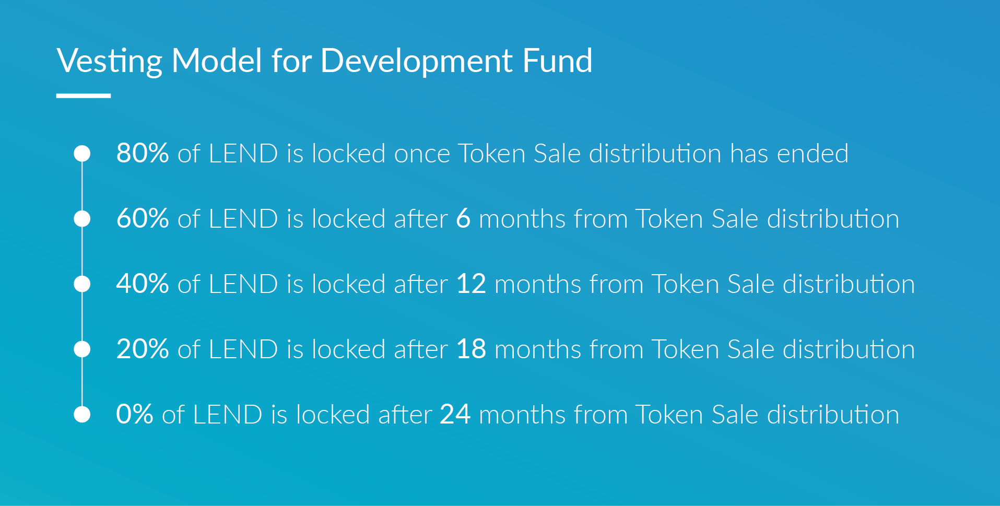

1.	80% of LEND is locked once Token Sale distribution has ended
2.	60% of LEND is locked after 6 months from Token Sale distribution
3.	40% of LEND is locked after 12 months from Token Sale distribution
4.	20% of LEND is locked after 18 months from Token Sale distribution
5.	0% of LEND is locked after 24 months from Token Sale distribution

The vesting model is active for 24 months in total. All tokens that are distributed to new team members from the development fund after the LEND token sale follows the vesting model on a pro-rata basis (will join the vesting model from the next mark).

The vesting model shall be activated with a smart contract once the token sale is complete.

For all new team members who joins ETHLend after the token sale period and are subject to the vesting model, a 6-month cliff-period is added. This means that if the person leaves before 6 month from the starting point, the members is not entitled to the vested tokens.
 

## <h2>Security</h2>

The token sale is performed with the use of Ethereum smart contract. Since all transactions are confirmed on the blockchain, the smart contract is resistant for security threats. The crowdsale smart contract code shall be available on GitHub and the code will be reviewed and audited by third party security auditing service.

The smart contract in itself is simple to avoid complex transactions. The smart contract will have extra security since the tokens are minted only when ETH is send to the address. This means that only way to receive LEND is by sending ETH, making it more resistant to misuse and fraud. Moreover, this gives the participant the opportunity to send a smaller amount of ETH to test whether LEND is received. Therefore, if the token address display is compromised, the loss is limited.

The token sale page shall be held on a DDOS protected environment, on a separate server with writing locks on the token sale page files from the server side. The token sale page will be simple and as static as possible to avoid any complexity. Besides the above, additional security measures are adopted.

Storing the funds. All raised funds are stored in divided multi-signature Ethereum wallets. Therefore, the access to funds would require multiple people to sign. Diversification of wallets provides extra-safety in case private key would be compromised. A spending account with less than 5% of the funds can be held on a single-signature account.

## <h2>Funds Allocation</h2>

Most of the funds are allocated to further development of the DAPP, either on core development or on user experience development. ETHLend provides the following funds allocation based on needs for application that ETHLend is developing:

*	30% on core development
*	20% on user experience development
*	20% on management & legal
*	20% on promotions & marketing
*	10% on unexpected costs

Funds allocation is subject to change for providing flexibility. ETHLend will use best practices on funds allocation and its own discretion.

## <h1>Entity behind ETHLend</h1> 

Entity behind ETHLend

ETHLend.io

Complaints & assistance: support [-at-] ethlend [dot] io

## <h1>Further Updates</h1> 

Further updates on LEND Token Sale and DAPP updates are published on http://ETHLend.io and in our mailing list.

Telegram: https://t.me/ETHLend

Website: https://ethlend.io

Blog: https://blog.ethlend.io

White Paper: https://github.com/ETHLend/Documentation/blob/master/ETHLendWhitePaper.md

DAPP Thread on BitcoinTalk: https://bitcointalk.org/index.php?topic=2013399

ICO Thread on BitcoinTalk: https://bitcointalk.org/index.php?topic=2089908.0

Bounty Thread on BitcoinTalk: https://bitcointalk.org/index.php?topic=2078686

Reddit: https://www.reddit.com/r/ETHLend/

Facebook: https://www.facebook.com/ETHLend/

YouTube: https://www.youtube.com/watch?v=IGaoqUoL1F4&t=2s

Twitter: https://twitter.com/ethlend1

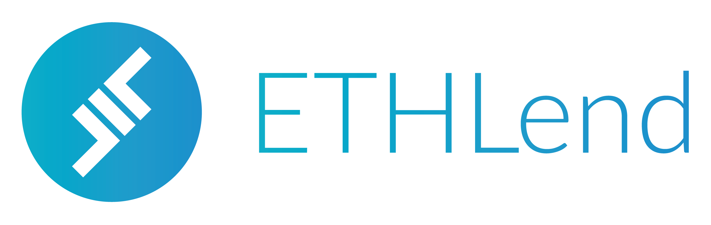
